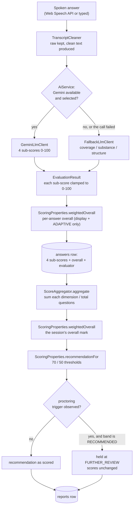

# Scoring — how a mark is produced, and how to check it by hand

**This is the complete description of how a candidate ends up with a number.**
Every figure on a report can be recomputed with a calculator from data the system
already stores, and this document shows exactly how. If a mark ever looks wrong,
work through §10 — it will either explain the number or find the bug.

Scope: evaluation and mark calculation only. For the system as a whole, read
`SYSTEM-OVERVIEW.md` first; for what these marks *cannot* be trusted to mean,
read `LIMITATIONS.md` and §13 here.

---

## 1. The rule that governs everything below

> **The language model contributes sub-scores. It never decides the mark.**

The LLM is asked for four numbers per answer and nothing else. Every step after
that — weighting, averaging, banding, the proctoring cap — is plain arithmetic in
Java against values in `application.yml`. That is what makes a result
defensible: it can be recomputed by hand, and changing a weight is a
configuration edit, not a code change.

The code that decides a mark is small and worth knowing by name:

| Class | File | Responsibility |
|---|---|---|
| `TranscriptCleaner` | `answer/TranscriptCleaner.java` | filler removal; produces the text that gets graded |
| `GeminiLlmClient` | `ai/GeminiLlmClient.java` | asks the model for four sub-scores |
| `FallbackLlmClient` | `ai/FallbackLlmClient.java` | the offline heuristic scorer |
| `AiService` | `ai/AiService.java` | picks LLM or fallback **per call** |
| `ScoringProperties` | `config/ScoringProperties.java` | the weights, the thresholds, `weightedOverall()`, `recommendationFor()` |
| `AnswerService` | `answer/AnswerService.java` | stores one answer's sub-scores and its own overall |
| `ScoreAggregator` | `report/ScoreAggregator.java` | per-answer scores → session scores |
| `RecommendationEngine` | `report/RecommendationEngine.java` | session score → recommendation + explanation |
| `ReportService` | `report/ReportService.java` | runs the above once, at completion |

---

## 2. The whole pipeline in one picture



**Every one of those arrows is deterministic except the two model boxes.** Given
the same four sub-scores, the same report comes out every time.

---

## 3. Where every number is stored

| Number | Column | Written by | Used for |
|---|---|---|---|
| raw transcript | `answers.raw_transcript` | `AnswerService` | never modified; audit trail |
| clean transcript | `answers.clean_transcript` | `TranscriptCleaner` | **this is what gets graded** |
| filler count, word count | `answers.filler_count`, `answers.word_count` | `TranscriptCleaner` | display; word count also feeds the fallback scorer |
| four sub-scores | `answers.technical_score`, `relevance_score`, `problem_solving_score`, `communication_score` | the model or the fallback | the session aggregate |
| per-answer overall | `answers.overall_score` | `ScoringProperties.weightedOverall` | report display, and ADAPTIVE's next-question context. **Not used by the session aggregate** |
| who graded it | `answers.evaluator` (`LLM \| FALLBACK`), `answers.model_name` | `AiService` | honesty about how the mark was produced |
| session dimension marks | `reports.technical_score`, `communication_score`, `problem_solving_score`, `relevance_score` | `ScoreAggregator` | the report |
| session overall mark | `reports.overall_score` | `ScoringProperties.weightedOverall` | the recommendation, the reports list, the Excel export |
| recommendation | `reports.recommendation` | `RecommendationEngine` | the report |
| the arithmetic in words | `reports.explanation` | `RecommendationEngine` | the report and the PDF |
| observation counts | `reports.proctor_summary` | `ProctorEventService.countsByType` | the cap, and the report |
| integrity flag | `reports.integrity_flag` | `RecommendationEngine` | "a human should look" |

---

## 4. Stage 1 — cleaning the transcript

`TranscriptCleaner.clean(raw)` runs **on the server**, in this order:

1. multi-word filler phrases (`you know`, `sort of`, `i mean`, `to be honest`,
   `or something`, and the position-sensitive ones below)
2. single filler words (`um`, `uh`, `umm`, `hmm`, `er`, `erm`, `ah`, `eh`,
   `basically`, `literally`, `obviously`, `essentially`, `anyway`)
3. immediately repeated words — `the the API` → `the API`
4. spacing tidy-up

Both lists are configuration (`app.transcript.*`). Matching is case-insensitive
and word-boundary anchored, so `Um` goes and `umbrella` stays.

### Why the word list is short

A listed word is removed **wherever it appears**, and the cleaned text is what
the evaluator scores — so any word with a common technical meaning corrupts the
answer being marked. Four words were taken off the list in Phase 21 for that
reason:

| The candidate said | The evaluator used to receive |
|---|---|
| "that's the **right** approach" | "that's the approach" |
| "the performance was **okay**" | "the performance was" |
| "an interface works **like** a contract" | "an interface works a contract" |
| "it **actually** returns null" | "it returns null" |

Words that are only hesitation in one *position* are handled as phrases instead:
`", right"` strips a trailing "…, right?" while leaving "the right approach"
untouched.

The bias is deliberately towards leaving a word in. An un-removed filler costs a
little polish in the communication sub-score; an over-removed word changes what
the candidate is judged to have said.

**What this does and does not affect:**

- The **raw** transcript is never modified. Both versions are stored.
- The **clean** text is what reaches the evaluator, on both paths.
- `filler_count` **never touches a mark.** Nothing in the scoring reads it; it is
  reported so a human can see how disfluent the speech was.
- `word_count` affects a mark **only on the fallback path** (§5b), and even there
  it is the *cleaned* word count that the fallback recomputes for itself from the
  text it was given.

The browser also cleans, so the candidate sees roughly what will be graded, but
the server's copy is the authoritative one.

---

## 5. Stage 2 — grading one answer

`AiService.evaluate()` chooses the provider **per call**, not per interview: the
quota can run out after the third answer, or the wifi can drop. Whichever path
answers, the result is the same shape — four integers plus prose — and the row
records which path it was.

### 5a. The LLM path

The prompt gives the model the question, the question's `expectedPoints`, the
cleaned answer, the domain and the difficulty, and asks for exactly:

| Field | Meaning as stated in the prompt |
|---|---|
| `technicalScore` | correctness and depth of the domain reasoning |
| `relevanceScore` | did they answer *this* question, and cover the expected points |
| `problemSolvingScore` | quality of approach, structure, trade-offs considered |
| `communicationScore` | clarity and organisation of the explanation |

plus `feedback`, `strengths`, `weaknesses`.

Three properties of this call matter for scoring:

- **There is deliberately no `overallScore` field.** The model is never asked for
  the outcome, so it cannot supply one.
- The call is **schema-constrained** (`responseMimeType: application/json` with a
  `responseSchema`), so the four numbers are parsed, not pattern-matched.
- **Every sub-score is clamped to 0–100 on the way in** (`EvaluationResult`'s
  compact constructor). A model returning `120` or `-5` cannot poison the
  arithmetic.

The prompt also tells the model to judge substance rather than grammar, not to
penalise transcription errors, and to score an empty or off-topic answer below
20.

### 5b. The offline fallback path

Used whenever Gemini is not selected (`INTERVIEW_AI_MODE=MOCK`, no API key) or
its call fails. **It does not understand the answer.** It measures three
observable proxies and says so in its own feedback text.

Given the cleaned answer and the question's `expectedPoints`:

```
words      = number of whitespace-separated tokens in the answer
sentences  = number of pieces after splitting on [.!?]+
covered    = expected points "mentioned" in the answer
```

An expected point counts as **mentioned** when any token in it of **5 or more
characters** appears as a substring of the lowercased answer. So
`"query execution plan"` is matched by the word `query` alone (`plan` is only 4
characters and cannot match on its own). This is deliberately loose — the
fallback should under-claim rather than pretend to comprehension.

Three ratios, each capped at 1.0:

```
coverage  = covered / expected          (0.5 when the question has no expected points)
substance = min(1, words / 120)
structure = min(1, sentences / 4)
```

Then the four sub-scores:

```
technical       = score(0.75·coverage + 0.25·substance)
relevance       = score(0.85·coverage + 0.15·substance)
problemSolving  = score(0.55·coverage + 0.25·structure + 0.20·substance)
communication   = score(0.50·structure + 0.50·substance)

where  score(ratio) = round(25 + clamp01(ratio) × 70)
```

`score()` maps onto **25–95**, never 0 or 100, so an offline mark is never
mistaken for a confident one.

**The one exception: a blank answer scores a straight 0/0/0/0**, with the
feedback "No answer was recorded for this question." The 25 floor applies only to
answers that contain something.

> **Java split trap, and it changes marks.** `sentences` comes from
> `answer.split("[.!?]+")`, and Java discards *trailing* empty strings. Text
> ending in a full stop therefore yields one fewer piece than you might count by
> eye: `"A. B. C."` splits into **3**, not 4. Worked example C in §10 relies on
> this.

---

## 6. Stage 3 — the per-answer overall

`AnswerService` immediately computes one more number and stores it on the row:

```
overall = round( (T×0.35 + PS×0.25 + C×0.20 + R×0.20) / (0.35+0.25+0.20+0.20) )
```

`ScoringProperties.weightedOverall(technical, problemSolving, communication, relevance)`.

- The division by the weight total means **the weights do not have to sum to 1**.
  With the shipped values the total is exactly 1.0, so the division changes
  nothing — but a viva answer of "we normalise by the weight total" is the honest
  one.
- Rounding is `Math.round`, i.e. **half rounds up**: `74.5 → 75`.
- If every weight were zero the method returns 0 rather than dividing by zero.

**This number does not feed the session's mark.** `ScoreAggregator` recomputes
the overall from the aggregated dimensions instead (§8), so there is exactly one
definition of "overall" in the system. The per-answer overall exists for two
things only: the per-question row on the report, and ADAPTIVE mode's
`PriorAnswerContext`, which tells the next generation call how the candidate did
on the previous question.

---

## 7. Stage 4 — the session's four dimension marks

At completion, `ScoreAggregator.aggregate(answers, totalQuestions)`:

```
technicalMark      = (sum of every answer's technical score)      / totalQuestions
relevanceMark      = (sum of every answer's relevance score)      / totalQuestions
problemSolvingMark = (sum of every answer's problem solving score)/ totalQuestions
communicationMark  = (sum of every answer's communication score)  / totalQuestions
```

Four rules decide what those sums and that divisor actually are:

1. **An unanswered question counts as zero, not as absent.** The divisor is the
   question count, never `answers.size()`. Otherwise answering one question
   perfectly and skipping four would beat attempting everything — and it must
   not.
2. **A missing sub-score is read as zero** (`orZero`), covering a row whose
   evaluation never completed.
3. **This is integer division, so each dimension mark truncates — it always
   rounds down.** Two answers of 80 and 75 average to 77, not 78. Only the
   overall (§8) rounds half-up. Mixing the two is intentional: the dimensions are
   inputs, and rounding an input up would flatter the result twice.
4. **`totalQuestions` is the number of questions that exist, not the number the
   interview asked for** — `ReportService` passes `questions.size()`. In FIXED
   mode those are the same. **In ADAPTIVE mode they are not**: only questions
   already generated exist, so finishing a five-question adaptive interview after
   two answers divides by three (the two answered plus the one already prepared),
   not by five. This is a known asymmetry, recorded in `SYSTEM-OVERVIEW.md` §16.

With no questions at all, everything is zero and no division happens.

---

## 8. Stage 5 — the session's overall mark

The **same** `weightedOverall` from §6, applied to the four aggregated marks:

```
overall = round( technicalMark×0.35 + problemSolvingMark×0.25
               + communicationMark×0.20 + relevanceMark×0.20 )
```

Note the argument order in the code — `weightedOverall(technical,
problemSolving, communication, relevance)` — relevance is last, not second. It is
an easy mis-read when checking a number by hand.

Averaging the per-answer overalls instead would give the same answer for linear
weights, but it would create a second definition of "overall". There is only one.

---

## 9. Stage 6 — the recommendation band, and the proctoring cap

`ScoringProperties.recommendationFor(overall)` is a two-threshold ladder:

| Overall mark | Recommendation |
|---|---|
| **≥ 70** (`recommended-threshold`) | `RECOMMENDED` |
| **50–69** (`further-review-threshold` … threshold−1) | `FURTHER_REVIEW` |
| **< 50** | `NOT_RECOMMENDED` |

Then `RecommendationEngine.decide` applies exactly one adjustment:

```
if  force-review-enabled
and any of PHONE_DETECTED / MULTIPLE_FACES / MULTIPLE_PERSONS was observed
and the band is RECOMMENDED
then the result is held at FURTHER_REVIEW
```

**The cap is one-directional and it is the only thing proctoring can do to a
mark:**

- it **cannot lower a score** — the four dimension marks and the overall are
  untouched;
- it **cannot produce `NOT_RECOMMENDED`**;
- it **cannot rescue** a low score — a 40 stays `NOT_RECOMMENDED` whatever the
  camera saw;
- observations outside the configured trigger list (a `TAB_SWITCH`, a
  `HEAD_TURN`) do not trigger it at all;
- `integrity_flag` is set whenever a trigger observation occurred, **whether or
  not it changed the outcome** — it means "a human should look", not "the result
  moved".

The wording rule holds in the generated explanation: observations are described
as "observations from automated browser-based detection, not evidence of
misconduct, and they may be false positives", and the text closes by saying the
recommendation is "advisory input for a human decision, not a hiring decision".

### Monitoring coverage changes the wording, never the mark

`MonitoringCoverage` (derived from the session's monitoring columns and its event
count) is passed into `decide` so the explanation can distinguish *"monitored,
nothing observed"* from *"nobody was watching"*. It adds a caveat sentence and
nothing else. Incomplete monitoring is the observer's failure, not the
candidate's, so penalising someone for a GPU fault would be unfair — and the
tests assert directly that an unwatched interview and a clean one receive the
same recommendation.

---

## 10. Calculating a mark by hand

Everything needed is on the report page (or in the database). No access to the
model is required — the model's contribution is already frozen into the four
sub-scores.

### The recipe

1. **List the questions.** Count them: that is your divisor `N`
   (`reports` page → the per-question list; or
   `SELECT COUNT(*) FROM questions WHERE session_id = ?`).
2. **For each question, write down its four sub-scores.** An unanswered question
   is `0, 0, 0, 0`.
3. **Add up each column** — four sums.
4. **Divide each sum by `N` and throw away the remainder** (round *down*). These
   are the four dimension marks.
5. **Apply the weights** to those four marks:
   `T×0.35 + PS×0.25 + C×0.20 + R×0.20`, then round to the nearest whole number
   (halves go up). That is the overall mark.
6. **Read the band**: ≥ 70 recommended, 50–69 further review, below 50 not
   recommended.
7. **Check the cap**: if the band is `RECOMMENDED` and the report lists any
   `PHONE_DETECTED`, `MULTIPLE_FACES` or `MULTIPLE_PERSONS` observation, the
   final recommendation is `FURTHER_REVIEW`.

### Worked example A — five questions, all answered

| Question | Technical | Relevance | Problem solving | Communication | (per-answer overall) |
|---|--:|--:|--:|--:|--:|
| Q1 | 78 | 82 | 70 | 75 | 76 |
| Q2 | 64 | 70 | 60 | 72 | 66 |
| Q3 | 88 | 90 | 84 | 80 | 86 |
| Q4 | 52 | 58 | 48 | 66 | 55 |
| Q5 | 71 | 74 | 66 | 70 | 70 |
| **Sum** | **353** | **374** | **328** | **363** | |

Divide each by 5 and truncate:

```
technical       353 / 5 = 70.6  -> 70
relevance       374 / 5 = 74.8  -> 74
problem solving 328 / 5 = 65.6  -> 65
communication   363 / 5 = 72.6  -> 72
```

Weight them:

```
70×0.35 = 24.50
65×0.25 = 16.25
72×0.20 = 14.40
74×0.20 = 14.80
                --------
          total  69.95  ->  round  ->  70
```

**Overall 70 → `RECOMMENDED`** (70 is *at* the threshold, and the comparison is
`>=`). Note how close this is: had communication aggregated to 71 instead of 72,
the total would have been 69.75 → 70 as well; had problem solving been 64, it
would have been 69.7 → 70. The truncation in step 4 is doing real work here.

If that session's report also listed one `PHONE_DETECTED`, the final line would
read `FURTHER_REVIEW`, with the same 70 and the same four dimension marks
printed above it.

### Worked example B — the same answers, two questions never answered

Q4 and Q5 are missing (no `answers` row). The sums shrink but **the divisor stays
5**:

| | Technical | Relevance | Problem solving | Communication |
|---|--:|--:|--:|--:|
| Sum of Q1–Q3 | 230 | 242 | 214 | 227 |
| ÷ 5, truncated | **46** | **48** | **42** | **45** |

```
46×0.35 = 16.10
42×0.25 = 10.50
45×0.20 =  9.00
48×0.20 =  9.60
                --------
          total  45.20  ->  45
```

**Overall 45 → `NOT_RECOMMENDED`**, and the explanation adds "The candidate
answered 3 of 5 questions; unanswered questions score zero."

### Worked example C — reproducing the offline fallback from raw text

Question expected points:

```
database indexing · query execution plan · connection pooling · result caching
```

Cleaned answer (38 words, ending in a full stop):

> "I would start by reproducing the slow request and reading the query execution
> plan. That usually shows a missing database indexing problem on the join
> column. I would add the index and measure again before changing anything else."

Work out the three ratios:

```
covered   = "database indexing"  (token "indexing" appears)
            "query execution plan" (token "query" appears)
            -> 2 of 4                     coverage  = 0.50
words     = 38                            substance = 38/120 = 0.3167
sentences = 3   (Java drops the trailing empty piece)
                                          structure = 3/4    = 0.75
```

Then the four formulas:

```
technical      = round(25 + 70 × (0.75×0.50 + 0.25×0.3167)) = round(25 + 70×0.4542) = 57
relevance      = round(25 + 70 × (0.85×0.50 + 0.15×0.3167)) = round(25 + 70×0.4725) = 58
problemSolving = round(25 + 70 × (0.55×0.50 + 0.25×0.75 + 0.20×0.3167)) = round(25 + 70×0.5258) = 62
communication  = round(25 + 70 × (0.50×0.75 + 0.50×0.3167)) = round(25 + 70×0.5333) = 62
```

Per-answer overall: `57×0.35 + 62×0.25 + 62×0.20 + 58×0.20 = 59.45 → **59**`.

Notice what this scorer rewarded: three sentences and half the keywords. It has
no idea whether the answer was correct. That is exactly why every fallback
evaluation is stamped `evaluator = FALLBACK` and the report says so.

### Cross-checks taken from the test suite

These are asserted in `report/ReportScoringTest`, so they are a safe way to
confirm your arithmetic matches the system's:

| Input | Expected result |
|---|---|
| Answers `(80,80,80,80)` and `(60,60,60,60)` over **2** questions | every dimension 70, overall **70** |
| One answer `(100,100,100,100)` over **5** questions | overall **20** |
| One answer T80 R90 PS60 C70 over **1** question | overall **75** |
| Five answers of 70 over 5 vs one answer of 100 over 5 | the thorough candidate scores higher |
| An `Answer` whose sub-scores are all null | overall **0** |
| High score + `PHONE_DETECTED` | `FURTHER_REVIEW`, `cappedByProctoring = true`, score unchanged at 85 |
| Low score + observations | still `NOT_RECOMMENDED` — the cap never rescues |
| `TAB_SWITCH` only (not a trigger type) | `RECOMMENDED`, `integrityFlag = false` |

---

## 11. What can and cannot move a mark

| Thing | Moves the mark? |
|---|---|
| The four sub-scores from the model or the fallback | **Yes** — they are the only inputs |
| Number of questions in the interview | **Yes** — it is the divisor |
| Leaving a question unanswered | **Yes** — it contributes zeros |
| The weights and thresholds in `application.yml` | **Yes**, for reports generated afterwards |
| Which provider graded the answer | **Yes**, indirectly — the two scorers are not calibrated to each other |
| Question difficulty | **No.** Difficulty is never a multiplier; a HARD question and an EASY one count the same |
| Time taken, or finishing early | **No.** Duration is reported, never scored |
| Filler-word count | **No** |
| Word count | Only on the fallback path (`substance`) |
| Proctoring observations | **Only** as a one-directional cap on the *recommendation* — never on a score |
| Incomplete or absent monitoring | **No** — it changes the explanation's wording only |
| A recruiter's decision (§14) | **No** — a review never alters the report |
| Re-answering a question | Impossible — the second submission is a `409` |

---

## 12. Configuration

```yaml
app:
  report:
    scoring:
      technical-weight: 0.35
      problem-solving-weight: 0.25
      communication-weight: 0.20
      relevance-weight: 0.20
      recommended-threshold: 70
      further-review-threshold: 50
    proctoring:
      force-review-enabled: true
      review-trigger-types: [PHONE_DETECTED, MULTIPLE_FACES, MULTIPLE_PERSONS]
```

- All of it is read through `ScoringProperties` and `ProctoringPolicyProperties`,
  picked up automatically by `@ConfigurationPropertiesScan`.
- **Changing a weight does not rewrite existing reports.** `reports` rows store
  the numbers that were computed at completion; a later change applies to
  interviews completed after it.
- Setting `force-review-enabled: false` disables the cap entirely.
  `integrity_flag` is still set, so the observation is still visible — the result
  simply is not held.

---

## 13. What these marks do not mean

Stated plainly, because a number invites more confidence than it has earned:

- **Not calibrated against human graders.** No study was done. The marks are
  internally consistent, not externally validated. Nothing here has been shown to
  predict anything about a candidate.
- **Not deterministic across runs on the LLM path.** The same answer can score
  slightly differently twice; only the arithmetic after the sub-scores is fixed.
- **The two scorers are not equivalent.** An interview graded partly by Gemini
  and partly by the offline heuristic mixes two scales. The report's
  `aiEvaluated` flag is true **only if every answered question was graded by the
  LLM**, precisely so a partial fallback is never presented as a full AI
  evaluation, and every question row shows which graded it.
- **The fallback measures keywords, length and sentence count.** A well-argued
  answer in different vocabulary scores poorly; a keyword-stuffed one scores
  well.
- **Prompt injection is not defended against.** A candidate could in principle
  speak instructions at the model. The blast radius is bounded — the model only
  returns four sub-scores, and the outcome is computed in Java — but it is
  untested.
- **Speech-to-text errors are graded as if spoken.** The prompt asks the model not
  to penalise transcription noise; the fallback has no such judgement.

---

## 14. The mark is advisory — the decision is recorded separately

The report has always ended by saying its output is "advisory input for a human
decision, not a hiring decision". That decision is captured on the report's
Decision tab and stored in `report_reviews` — deliberately in a **different
vocabulary** from the model's:

| The system says (`Recommendation`) | The person says (`ReviewDecision`) |
|---|---|
| `RECOMMENDED` | `ADVANCED` |
| `FURTHER_REVIEW` | `ON_HOLD` |
| `NOT_RECOMMENDED` | `DECLINED` |

One shared vocabulary would make "the system said RECOMMENDED" and "the recruiter
said RECOMMENDED" indistinguishable at a glance, in a design that rests on
keeping them apart. A review **never alters the report** — scores, recommendation
and explanation stay exactly as computed, and a test asserts it. Whether the
human agreed with the model is derived, not stored.

---

## 15. Related documents

| Document | For |
|---|---|
| `SYSTEM-OVERVIEW.md` | the whole system; §8 for question generation, §9 for the report |
| `LIMITATIONS.md` | what the system as a whole cannot be trusted to do |
| `DATABASE.md` | the tables these numbers live in |
| `API.md` | the endpoints that produce and read them |
