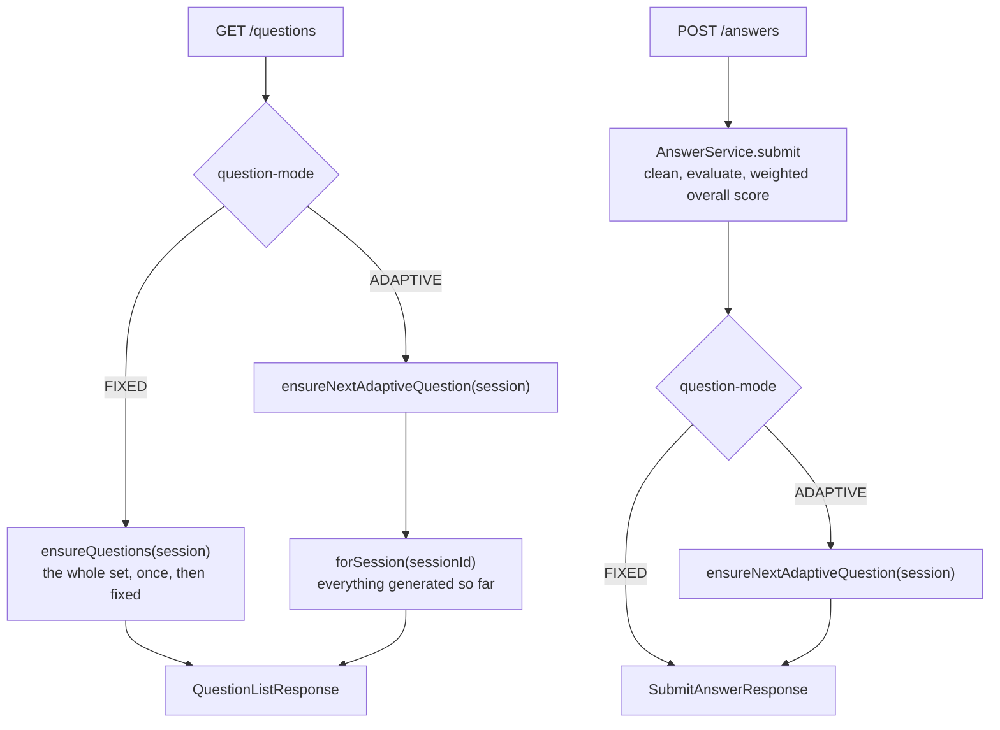

# System Overview

**The single document to read first.** It describes what this application is,
every feature it has, how a request travels through it, what the data means, and
which rules must not be broken. Written so that a person or an AI agent with no
prior context can work on the codebase after reading it.

Companion documents go deeper on individual areas:

| Document | For |
|---|---|
| **`SCORING.md`** | **how a mark is produced, and how to recompute one by hand** |
| `LIMITATIONS.md` | what this system cannot be trusted to do (a deliverable, not a footnote) |
| `DATABASE.md` | tables, columns, ER diagram |
| `API.md` | endpoint reference |
| `UI-ARCHITECTURE.md` | the Thymeleaf shell, sidebar and page structure |
| `BULK-SCHEDULING.md` | the Excel upload flow in detail |
| `INTERVIEW-MANAGEMENT.md` | search, filters, tabs, paging, bulk mutation |
| `EMAIL-NOTIFICATIONS.md` | SMTP setup and the invitation email |
| `DEPLOYMENT.md` | running it somewhere real |
| `RELEASE-READINESS.md` | what has actually been verified, and by what |
| `IMPROVEMENT-PLAN.md` | the audit and the phased plan behind recent work |
| `TEST-PLAN.md`, `ATTRIBUTION.md`, `ARCHITECTURE.md` | test strategy, credits, an earlier architecture write-up |

**Where a companion document disagrees with this one, this one is right.**
`ARCHITECTURE.md` and `TEST-PLAN.md` predate the timed interview (V5) and
everything after it, and have not been revised.

---

## 1. What this is

An **AI-based proctored interview system**, built as a final-year academic
prototype. It demonstrates one complete workflow end to end:

```
recruiter schedules an interview
   → candidate signs in and opens it
   → browser monitors the environment with local AI
   → an AI asks questions; the candidate answers by voice
   → answers are transcribed, cleaned and evaluated
   → a deterministic report and recommendation are produced
```

Two products run over one session and meet in the report:

| | Product A — Proctoring | Product B — Interview |
|---|---|---|
| Runs in | The browser | The server |
| Uses | MediaPipe Face Landmarker, COCO-SSD | Gemini (optional) + offline fallback |
| Produces | `proctor_events` | `questions`, `answers` |
| Joined on | `interview_sessions.id` | `interview_sessions.id` |

**It is a prototype, not a production system.** Every choice favours the
simplest thing that genuinely works and can be explained in a viva.

### The wording rule that governs the whole system

**Detection is never an accusation.** `PHONE_DETECTED` means *"a phone was
detected"*, never *"the candidate cheated"*. This holds in code, comments, UI
copy, the report and the database. Proctoring can only ever **cap** a result at
`FURTHER_REVIEW` so a human looks at it; it can never lower a score and can
never produce `NOT_RECOMMENDED`.

---

## 2. Roles and capabilities

Three roles, one `users` table, `role ENUM(ADMIN, RECRUITER, CANDIDATE)`.

| Capability | Admin | Recruiter | Candidate |
|---|:--:|:--:|:--:|
| Create users | ✅ | ❌ | ❌ |
| Enable/disable a user | ✅ | ❌ | ❌ |
| Schedule an interview (single) | ✅ | ✅ | ❌ |
| Schedule for several candidates at once | ✅ | ✅ | ❌ |
| Schedule interviews in bulk (Excel) | ✅ | ✅ | ❌ |
| Manage/search/filter interviews | all | own only | ❌ |
| Edit or delete a scheduled interview | all | own only | ❌ |
| Bulk edit / bulk delete | all | own only | ❌ |
| View interview detail `/interviews/{id}` | all | own only | ❌ 403 |
| See own interview dashboard | — | — | ✅ |
| Sit an interview | ❌ | ❌ | ✅ |
| View a report | all | own only | own, **and only if** the recruiter enabled it |
| Record a decision on a report | all | own only | ❌ **404** |
| Browse candidates (`/{role}/candidates`) | all | own only | ❌ 403 |
| See AI provider health (`/admin/ai-health`) | ✅ | ❌ | ❌ |
| Erase a candidate's data (`/admin/data-retention`) | ✅ | ❌ | ❌ |

Seeded accounts (idempotent, per-account, in `config/DataSeeder`):

| Email | Password | Role |
|---|---|---|
| `admin@demo.local` | `Admin@123` | ADMIN |
| `recruiter@demo.local` | `Recruiter@123` | RECRUITER |
| `candidate@demo.local` | `Candidate@123` | CANDIDATE |

---

## 3. Technology stack

| Layer | Choice |
|---|---|
| Backend | Spring Boot **4.0.7**, Java 25, Maven wrapper (`.\mvnw.cmd`) |
| Persistence | Spring Data JPA / Hibernate, MySQL 8, **Flyway** migrations |
| Security | Spring Security 7 — two filter chains, JWT (jjwt 0.12.6) + form login |
| Staff UI | Thymeleaf, server-rendered |
| Candidate exam UI | React 19 + Vite 6 (separate `frontend/` build) |
| Browser AI | `@mediapipe/tasks-vision` (Face Landmarker), `@tensorflow-models/coco-ssd` |
| LLM | Google Gemini free tier via plain `RestClient`, with an offline fallback |
| Speech | Web Speech API (Chrome/Edge only) + manual typing fallback |
| Excel | Apache POI (`poi-ooxml`) |

Vite builds into `src/main/resources/static/exam/`, so the final artifact is a
**single runnable JAR**.

### Spring Boot 4 traps — read before touching the build

Boot 4 differs from every Boot 3 tutorial. These cost real debugging time:

1. **Starters renamed**: `spring-boot-starter-webmvc` (not `-web`),
   `spring-boot-starter-flyway`, and **Jackson is a separate starter**
   (`spring-boot-starter-jackson`) — without it there is no `ObjectMapper` bean.
2. **Jackson 3**: the auto-configured bean is `tools.jackson.databind.ObjectMapper`,
   **not** `com.fasterxml.jackson.databind.ObjectMapper`. Jackson 2 is also on the
   classpath (pulled in by jjwt) but is *not* the Spring bean. Build mappers with
   `JsonMapper.builder().build()`. `JsonNode.asText()` is deprecated → prefer
   `readValue(json, Map.class)`.
3. **Test annotations moved**:
   `@DataJpaTest` → `org.springframework.boot.data.jpa.test.autoconfigure`;
   `@AutoConfigureMockMvc` → `org.springframework.boot.webmvc.test.autoconfigure`;
   `@SpringBootTest` unchanged.
4. **Spring Initializr writes a non-existent version** (`4.0.7.RELEASE`). The real
   Maven artifact is `4.0.7`.

---

## 4. Runtime architecture

```
Browser (Chrome/Edge)
 ├─ Thymeleaf pages ........ login, admin, recruiter, candidate dashboard
 │                            (session cookie + CSRF)
 └─ React SPA at /exam/{token} ................................. (JWT bearer)
        ├─ MediaPipe Face Landmarker   face count + head pose   @ 5 fps
        ├─ COCO-SSD                    person + cell phone      @ 1 fps
        └─ Web Speech API              speech → text
                    │  REST/JSON — events and answers only, NEVER video
                    ▼
Spring Boot 4 (port 8080)
 ├─ chain 1: /api/**  stateless JWT, JSON 401/403
 ├─ chain 2: everything else — form login + session + CSRF
 └─ RestClient ────────► Gemini API   (optional, with offline fallback)
                    ▼
MySQL 8 @ 3360 — schema proctor_interview (Flyway-managed, ddl-auto: validate)
```

### The two security chains

`config/SecurityConfig` defines exactly two `SecurityFilterChain` beans.
**Which chain handles a request is decided purely by whether the path starts
with `/api/`.** Getting this wrong is the single most common mistake when adding
an endpoint.

| | Chain 1 | Chain 2 |
|---|---|---|
| Matcher | `/api/**` (highest precedence) | everything else |
| Auth | JWT bearer token | form login, session cookie |
| CSRF | disabled (stateless, nothing to ride) | **enforced on every POST** |
| Failure | JSON `401` / `403` | redirect to `/login` |
| Used by | React exam SPA | all Thymeleaf pages |

Path rules inside chain 1:

```
/api/auth/login                                  permitAll
/api/users/**                                    ADMIN
/api/interviews/**                               ADMIN, RECRUITER
/api/exam/**, /api/interview-sessions/**         CANDIDATE
anything else                                    authenticated
```

Note `/api/reports/**` matches no rule and falls through to `authenticated()`
**on purpose**: all three roles may read a report, but *which* report depends on
ownership and on the recruiter's visibility flag. That cannot be expressed as a
path rule, so `ReportService.assertCanView` is the authority — and the same
method backs the Thymeleaf page, so the two cannot drift apart. When an
authorization rule depends on the row rather than the route, put it in the
service, not in `SecurityConfig`.

Path rules inside chain 2:

```
/, /login, /error                                permitAll
/forgot-password, /reset-password                permitAll   ← signed out by definition
/css/**, /js/**, /images/**, /favicon.ico        permitAll
/exam/**            permitAll   (the React bundle; its API calls need the JWT)
/admin/**           ADMIN
/recruiter/**       RECRUITER
/scheduling/**      ADMIN, RECRUITER      ← bulk scheduling is NOT under /api
/interviews/**      ADMIN, RECRUITER      ← detail view; candidates get 403
/reports/**         ADMIN, RECRUITER, CANDIDATE  (ownership checked in service)
anything else       authenticated
```

### Login throttling, password reset and response headers

**Repeated failed logins lock an account, not an IP.** `LoginAttemptService`
counts failures in memory — **5** within a **15-minute** window locks for
**10 minutes** — and is hooked in through `AppUserDetails.isAccountNonLocked()`,
so **one mechanism covers both chains**: form login and `POST /api/auth/login`
authenticate through the same `ProviderManager`. `SecurityConfig` must hand that
manager an event publisher or `LoginAttemptListener` never fires.

- **Keyed by account on purpose.** An IP key is trivially rotated and shared
  behind one address. The cost is that somebody can lock an account for ten
  minutes; the lock expiring by itself is what keeps that a nuisance rather than
  a denial of service.
- **A lockout never reaches an issued JWT.** `JwtAuthenticationFilter` reloads
  the account and checks only `isEnabled`, so nobody can throw a candidate out of
  a live interview by failing logins against their email.
- **A locked account fails identically to a wrong password** — the standing rule
  that nothing may reveal whether an account exists.

**Password reset** (`passwordreset/`, V8) issues a single-use token valid for
`app.password-reset.expiry-minutes` (30). Only its **SHA-256 hash** is stored;
requesting again supersedes the earlier link, redeeming clears the throttle, and
requesting **always reports the same thing** whatever the address. SHA-256 rather
than bcrypt is deliberate: 256 random bits have no dictionary to attack, and
lookup is *by* the hash, which a per-row salt would make impossible.

**Response headers are applied to both chains** from one place in
`SecurityConfig`: a Content-Security-Policy, `X-Content-Type-Options`, a
strict-origin referrer policy, a Permissions-Policy that grants `camera=(self)`
and `microphone=(self)` and denies geolocation, payment and USB, and HSTS for a
year.

> **The CSP does not stop injected script from executing.** `'unsafe-inline'`
> and `'unsafe-eval'`/`'wasm-unsafe-eval'` are load-bearing here — inline
> handlers, roughly 150 inline styles, TensorFlow.js and MediaPipe's WASM all
> need them. What it *does* do is pin every origin to `'self'` (`connect-src`,
> `object-src 'none'`, `base-uri`, `form-action`, `frame-ancestors`), so an
> injected script has nowhere to send anything. Verified in a real browser:
> models load, no violations.

**The token itself.** HS256, signed with `app.jwt.secret` (≥ 32 chars;
`JWT_SECRET` in anything real), valid for `app.jwt.expiry-minutes` = **240**.
Subject is the user id, with email, role and name as claims. The browser keeps it
in `sessionStorage`, so it does not outlive the tab, and sends it only in the
`Authorization` header.

**A disabled user's JWT stops working immediately.** `JwtAuthenticationFilter`
re-reads the account from the database on every request rather than trusting the
token until it expires. The claims are never the authority on who the caller is
or what they may do — the row is.

### The React exam SPA

One bundle, served from `/exam/{token}` and built by Vite into
`src/main/resources/static/exam/`. `App.jsx` is a small stage machine and the
only place the interview mode is resolved:

```
LOADING ─→ LOGIN            (no JWT, or a 401 from /api/exam/{token})
        ─→ INSTRUCTIONS ─→ DEVICE_CHECK ─→ EXAM ─→ DONE
        ─→ ERROR           (cancelled interview, missing or foreign link → 404)
```

| File | Responsibility |
|---|---|
| `main.jsx` | Entry point: mounts `App` inside React **StrictMode**, which double-invokes effects in development — the reason question audio uses cancel-then-speak rather than an "already spoken" flag |
| `App.jsx` | Stage machine, invite token from the URL, resolves NORMAL/DEMO once for the whole interview |
| `api.js` | Every REST call. JWT in `sessionStorage`, sent only as a bearer header |
| `screens/LoginScreen.jsx` | Signing in when the SPA is opened without a session |
| `screens/InstructionsScreen.jsx` | What the interview is, and plainly what is monitored |
| `screens/DeviceCheckScreen.jsx` | Camera/mic permission, then **stops the audio track** before handing the stream on |
| `screens/ExamScreen.jsx` | The interview itself: phases, countdown, finish, and the NORMAL/DEMO layout split |
| `interview/QuestionPanel.jsx` | One question: read aloud, answered by speech or typing, submit, retry |
| `interview/useSpeechRecognition.js` | Speech **in** — the microphone, the candidate's answer (Chrome/Edge only) |
| `interview/useSpeechSynthesis.js` | Speech **out** — the question read aloud through the speakers |
| `interview/useCountdown.js` | Ticks the server's `remainingSeconds`; `sync()` on load and after every answer |
| `proctor/useProctoring.js` | Owns both detector loops, the event engine and the uploader |
| `proctor/eventEngine.js` | The pure per-rule state machine (§7) |
| `proctor/eventUploader.js` | Batching, retry, and the flush on finish |
| `proctor/faceDetector.js`, `objectDetector.js` | MediaPipe Face Landmarker / COCO-SSD wrappers |
| `proctor/browserEvents.js` | Tab visibility, window blur, fullscreen exit |
| `proctor/useFullscreen.js` | Fullscreen state and the re-entry prompt |
| `proctor/DemoMonitor.jsx`, `DetectionOverlay.jsx` | DEMO-only presentation, drawn from the same status object |
| `interviewMode.js` | Resolves the server's mode string; anything unrecognised → NORMAL |

`ExamScreen` derives every control from **one** `phase` value
(`LOADING_QUESTIONS · IN_PROGRESS · LOADING_NEXT · ALL_ANSWERED · FINISHING ·
LOAD_FAILED`) rather than from separate booleans — see §14 for the bug that
caused.

---

## 5. Package map

```
com.project.proctorinterview
├── ai/          LlmClient, GeminiLlmClient, FallbackLlmClient, AiService
├── answer/      Answer entity, AnswerService, TranscriptCleaner
├── auth/        JWT issue/verify, AuthController, AppUserDetails(Service)
├── bulk/        Excel upload → validate → stage → confirm  (bulk scheduling)
├── common/      Enums, ApiException, GlobalExceptionHandler, JPA converters
├── config/      SecurityConfig, DataSeeder, all @ConfigurationProperties
├── interview/   Interview, InterviewSession, scheduling, exam, query, bulk-edit
├── proctor/     ProctorEvent ingest (idempotent batch endpoint)
├── question/    Question entity + generation
├── report/      ScoreAggregator, RecommendationEngine, ReportService
├── user/        User, CandidateProfile, RecruiterProfile, UserService
└── web/         Thymeleaf page controllers (thin adapters over services)
```

**Layering rule:** the service layer holds the rules **once**. Thymeleaf
controllers and REST controllers are both thin adapters over the same service.
If a rule exists in a controller, it is in the wrong place.

### The `config` package

`ProctorInterviewApplication` is annotated `@ConfigurationPropertiesScan`, so
every `@ConfigurationProperties` record in `config/` is picked up automatically —
no `@EnableConfigurationProperties` list to maintain.

| Class | Prefix | Holds |
|---|---|---|
| `JwtProperties` | `app.jwt` | secret, expiry |
| `SeedProperties` | `app.seed` | seed accounts toggle |
| `InterviewAiProperties` | `app.interview` | `ai-mode: MOCK \| GEMINI`, default question count |
| `InterviewModeProperties` | `app.interview` | `mode: NORMAL \| DEMO` — what the candidate's screen shows. Binds a String so an invalid value falls back rather than failing startup |
| `QuestionModeProperties` | `app.interview` | `question-mode: FIXED \| ADAPTIVE` — the **server default** for question generation, and `effectiveFor()`, the one place an interview's own choice falls back to it. Binds a String so an invalid value falls back rather than failing startup |
| `GeminiProperties` | `app.gemini` | api-key, model, base-url, timeout |
| `ScoringProperties` | `app.report.scoring` | 4 weights, 2 thresholds, `weightedOverall()`, `recommendationFor()` |
| `ProctoringPolicyProperties` | `app.report.proctoring` | force-review toggle + trigger event types |
| `TranscriptProperties` | `app.transcript` | filler phrases and words |
| `LoginThrottleProperties` | `app.login-throttle` | enabled, max attempts (5), window (15 min), lock (10 min). Every value self-corrects to a sane default rather than failing startup |
| `PasswordResetProperties` | `app.password-reset` | link lifetime in minutes (30; anything outside 1–1440 falls back) |
| `MailProperties` | `app.mail` | enabled, from, from-name, base-url, plus `sendable()` and the invite/dashboard link builders |
| `RetentionProperties` | `app.retention` | how long interview data is *expected* to be kept. Drives a report, never a purge |

`ScoringProperties` is not a dumb holder — **the outcome arithmetic lives on
it**, so there is exactly one definition of "overall score" and one of
"recommendation band" in the system.

---

## 6. The five flows

### Flow 1 — Schedule one interview

```
Recruiter → GET  /recruiter/interviews/new     form (candidates + domains)
          → POST /recruiter/interviews         CSRF-protected
                     ↓
            InterviewService.create
              ├─ candidate must exist, be enabled, be a CANDIDATE
              ├─ scheduledAt must be in the future
              ├─ EXPERIENCED ⇒ experienceYears ≥ 1; FRESHER ⇒ must be null
              ├─ questionCount 1..10
              └─ inviteToken = random UUID (unique)
                     ↓
            interviews row, status = SCHEDULED
```

Admins use the same service through `/admin/...` routes, and both roles render
the same form through `InterviewManagementController.scheduleForm`.

**Scheduling for several candidates** (`/{role}/interviews/new-multi`) is the
same form with a candidate multi-select. `MultiScheduleService` loops over the
selection and calls `InterviewService.create` per candidate through
`MultiScheduleRowScheduler`, which is a separate bean carrying
`@Transactional(REQUIRES_NEW)` for the same proxy reason as `BulkRowScheduler`:
one refused candidate must not roll back the interviews already created for the
others. Failures are collected per candidate and reported, never swallowed. A
duplicate selection creates one interview; `MAX_CANDIDATES` caps a submission at
100.

### Flow 2 — Bulk schedule from Excel

Full detail in `BULK-SCHEDULING.md`. Shape:

```
GET  /scheduling/bulk/template     download the .xlsx template
POST /scheduling/bulk/validate     parse + validate; CREATES NOTHING
        → staged in BulkStagingStore (in memory, 30 min, per user)
GET  /scheduling/bulk/errors/{id}  annotated error workbook
POST /scheduling/bulk/confirm      RE-VALIDATES, then writes
GET  /scheduling/bulk/result/{id}  result page
GET  /scheduling/bulk/report/{id}  .xlsx result workbook (incl. generated passwords)
```

Rules that matter:

- **Nothing is created until `confirm`**, and confirm **re-validates** — the
  client's verdict is never trusted.
- **Every row goes through `InterviewService.create`**, the same method the
  single form uses. A bulk-created interview is an ordinary interview.
- `BulkRowScheduler` is a **separate bean** on purpose: `@Transactional`
  is proxy-based, so `REQUIRES_NEW` is ignored on self-invocation — one bad row
  would otherwise roll back the whole batch.
- Missing candidate accounts are created with a generated password. The
  plaintext is **never persisted**; the result workbook, available only while the
  batch is staged, is the only place to read it.
- `/scheduling/**` is on the **session + CSRF chain**, not `/api/**`.

### Interview execution mode

`app.interview.mode` (`INTERVIEW_MODE`), **default `NORMAL`**:

| | NORMAL | DEMO |
|---|---|---|
| Purpose | The real candidate experience | Demonstration, development, viva |
| Interview screen | Question, answer, progress, time remaining, Finish | The same, plus a proctoring monitor and detection overlay |
| Camera preview | Present but off-screen (detectors need frames) | Visible, with face/person/phone boxes |
| Detection pipeline | Identical | Identical |
| Events recorded | Identical | Identical |
| Report | Identical | Identical |

**The mode is presentation only.** `useProctoring` runs with the same
thresholds and produces the same `proctor_events` in both modes; the mode
decides whether any of it is drawn. DEMO never disables proctoring and never
fabricates a value — everything it shows was computed by the candidate's own
browser from their own camera on that frame.

Anything missing, blank or unrecognised resolves to `NORMAL` at **both** ends
(`InterviewModeProperties.resolved()` and `interviewMode.js`). The property
binds a `String` rather than the enum precisely so `INTERVIEW_MODE=INVALID`
starts the application in NORMAL and warns, instead of refusing to start.

Metrics DEMO shows, all real: camera track state, microphone
granted/listening/idle, fullscreen state, face count, person count, phone with
its confidence, head direction, model load state, conditions currently being
held open by the engine, per-type event counts, and pending uploads. Metrics it
does **not** show, because the prototype does not compute them: attention,
emotion, gaze, eye or lip tracking, liveness, or any accuracy figure.

### Flow 3 — Candidate sits the interview

```
Candidate signs in → GET /                     home.html
        CandidateInterviewService.dashboard(candidateId)
        → cards grouped: Today · In Progress · Upcoming · Completed · Cancelled
                     ↓ click Start (or open the invite link directly)
GET  /exam/{token:[^.]+}        React shell (public page)
GET  /api/exam/{token}          ExamInfo — config, instructions, existing sessionId
                     ↓ InstructionsScreen → DeviceCheckScreen
POST /api/exam/{token}/start    {cameraGranted, micGranted, browserInfo}
        → interview_sessions row (ACTIVE), interview → IN_PROGRESS
                     ↓ ExamScreen mounts
GET  /api/interview-sessions/{id}/questions
        → FIXED    : ensureQuestions — the whole set, once, then fixed
        → ADAPTIVE : ensureNextAdaptiveQuestion — the next question if one is
                     due, then everything generated so far
                     ↓ per question
POST /api/interview-sessions/{id}/answers
        → clean transcript → evaluate → store inline on answers
        → ADAPTIVE : generate the next question from this answer's score
                     ↓ candidate finishes (or clicks "Finish test")
POST /api/interview-sessions/{id}/complete
        → ReportService.completeSession: report, session COMPLETED,
          interview COMPLETED. Idempotent.
```

Ownership rules on this path:

- **The invite token alone is not access.** The signed-in candidate must be the
  one the interview was scheduled for. A stranger's link returns **404, not
  403**, so it does not confirm the link exists. (Same reasoning as a login
  returning one message for both unknown email and wrong password.)
- Reloading mid-interview **resumes** the same session, the same clock and the
  same questions — every question in FIXED mode, everything generated so far in
  ADAPTIVE — landing on the first unanswered question.
- A question can be answered **once**. Re-answering is a `409` — an interview
  moves forward only, so nobody revises after seeing later questions.

### Interview duration and expiry

**An interview is a timed test, and the server owns the clock.**

Duration is configured **per interview**, not globally: `interviews.duration_minutes`
(`NOT NULL`, default 30, valid range **1–180**, bounds in `InterviewDtos`). It is
set on the scheduling form and validated identically on all four write paths —
single create, update, bulk edit and Excel upload — by `InterviewService.validDuration`.

**The clock starts when the candidate starts, not at `scheduled_at`.** A candidate
who joins late gets their full duration; nobody is penalised for the gap between
the slot and the moment they actually begin.

Neither the deadline nor the elapsed duration is stored. Both are derived, so
neither can go stale:

```
deadline        = interview_sessions.started_at + duration_minutes
actual duration = interview_sessions.ended_at   - started_at
```

The candidate sees a **countdown**, seeded from the server's `remainingSeconds`
and resynced from the server on load and after **every** submitted answer
(`useCountdown.js`). Local ticking is display convenience only, measured against
wall-clock deltas so a throttled background tab does not drift.

**A refresh resumes; it never restarts.** Reloading re-fetches the session and
gets the real remaining time, because the server recomputes it from the session's
own `startedAt`. A timer written as "30 minutes from page load" would hand out
unlimited time to anyone who pressed F5.

Enforcement is server-side and independent of what the browser shows:

- `ExamService.requireActiveSession` — called by every session-write endpoint —
  rejects work past the deadline with a **409**. Answers already submitted are
  kept.
- `SessionExpiryService.expire()` is its **own bean** carrying
  `@Transactional(REQUIRES_NEW)`, so the expiry record survives the rollback
  caused by the very exception that triggered it. It sets
  `ended_at = deadline` and `completion_reason = TIME_EXPIRED`.
- `ReportService.completeSession` independently re-derives the reason if it is
  not already set, covering a candidate who calls `/complete` after the clock
  ran out without any intervening write.
- `InterviewExpirySweeper` (`@Scheduled`, every 60 s) finalises sessions that
  ran out **while nobody was looking** — a candidate who closes the laptop
  triggers neither the countdown nor a later request, and without it the session
  would sit `ACTIVE` for ever. It is a safety net, not a second deadline system:
  it asks the same `hasExpiredAt` and finalises through the same
  `ReportService.completeSession`, so an interview closed by the sweep is
  indistinguishable from one closed any other way.

**Why the interview ended is recorded separately from the session's status.**
`interview_sessions.completion_reason` is `CANDIDATE_FINISHED | TIME_EXPIRED`,
and `status` stays `COMPLETED` either way. Folding "ran out of time" into the
status enum would mean a timed-out session was no longer `COMPLETED`, and every
existing query looking for `COMPLETED` would silently start missing them. The
column is `NULL` while a session is running, and `NULL` for sessions that
finished before it existed — their reason genuinely is not known, and
`CANDIDATE_FINISHED` would be a guess.

In the browser, running out of time finishes through **exactly the same path**
as the Finish button (`ExamScreen.doFinish`, guarded so it can only run once),
so an expired interview produces a report through the ordinary pipeline rather
than a second code path. The server still labels it `TIME_EXPIRED` — the client
only asks to close, it never says why.

The report shows allocated vs actual duration, the completion reason, and
per-answer timing (`ReportService.buildTiming` → `TimingSummary`), on the web
report and in the PDF export.

### Flow 4 — Manage interviews

Full detail in `INTERVIEW-MANAGEMENT.md`.

`/admin/interviews` and `/recruiter/interviews` render the **same template**
through `InterviewManagementController.renderManagement`. The only difference is
scope, decided server-side.

- Search (name / candidate name / candidate email), eight optional filters,
  quick tabs, sorting, paging, six summary counts.
- Filtering uses `JpaSpecificationExecutor` + one `InterviewSpecifications`
  builder rather than a finder per combination.
- **Authorization is a scope predicate ANDed server-side** from the principal.
  A filter can never widen it. Admins get `UNRESTRICTED` (an always-true
  conjunction) because Spring Data rejects a `null` Specification.
- Detail view `/interviews/{id}` is assembled **inside the service transaction**
  into `InterviewDetailView` — open-in-view is off, so handing entities to a
  template throws `LazyInitializationException`.
- **"Needs attention" is derived from data, not stored.** There is no `NO_SHOW`
  status and none was invented; it is inferred from (scheduled, time passed, no
  session). Same for missing-report and stalled-in-progress.

### Flow 5 — Edit and delete (single and bulk)

```
GET  /{admin|recruiter}/interviews/{id}/edit       edit form
POST /{admin|recruiter}/interviews/{id}/edit       InterviewService.update
POST /{admin|recruiter}/interviews/{id}/delete     InterviewService.delete
POST /{admin|recruiter}/interviews/bulk-edit       BulkInterviewMutationService
POST /{admin|recruiter}/interviews/bulk-delete     BulkInterviewMutationService
```

Both role prefixes delegate to the **same** methods on
`InterviewManagementController`, which take the action URLs as parameters — the
admin and recruiter routes cannot drift apart.

Rules:

- **Only a `SCHEDULED` interview can be edited or deleted.** Once a session
  exists the questions were already generated against the old domain / question
  count / candidate type, so editing would silently invalidate them.
- **Delete is a plain hard delete, and safe because of that restriction**: a
  `SCHEDULED` interview with no session has no dependent question, answer,
  proctor-event or report row. `InterviewService.delete` still re-checks for a
  session as defence in depth before deleting the parent row.
- **Candidate, recruiter, invite token and status are never edited.** Reassigning
  a candidate is a reschedule, not an edit; only `cancel` and the exam flow move
  status.
- **Bulk edit is a field mask.** `BulkEditFields` carries an `applyX` boolean per
  field; only flagged fields change. Every row is validated exactly as a single
  edit would be, so a bulk action can never produce a state the single form would
  have rejected.
- **`BulkInterviewRowMutator` is a separate bean** for the same proxy reason as
  `BulkRowScheduler`: `REQUIRES_NEW` per row, so one failure never rolls back
  rows that already succeeded. Failures are collected and reported, not swallowed.
- **"Select all matching filter" is recomputed server-side** by
  `InterviewQueryService.idsMatching(filter, userId, role)` from the filter plus
  the caller's own scope. The browser sends a filter description, never an id
  list, so there is nothing to tamper with to widen the target set.

---

## 7. Product A — the proctoring pipeline

```
getUserMedia → <video>
   ├─ face loop   (200 ms) → FaceLandmarker → {faceCount, yaw, pitch}
   └─ object loop (1000 ms) → COCO-SSD      → [{class, score, bbox}]
                      ↓
              EventEngine  (confidence gate → enter/exit debounce → open/close)
                      ↓ batched every 10 s / 20 events
      POST /api/interview-sessions/{id}/proctor-events  → proctor_events
```

`frontend/src/proctor/eventEngine.js` is the most important file in Product A.
It is a **pure module** — no DOM, no timers, no network, time is injected. That
is what makes its 24 tests possible. Per-rule state machine:

```
IDLE → PENDING (held enterMs) → OPEN → (clear for exitMs) → emit
```

Thresholds live in `frontend/src/proctor/proctorConfig.js`:

| Condition | Event | Min conf | Enter | Exit | Min duration |
|---|---|---|---|---|---|
| 0 faces | `NO_FACE` | — | 3.0 s | 1.0 s | 3.0 s |
| ≥2 faces | `MULTIPLE_FACES` | — | 2.0 s | 1.5 s | 2.0 s |
| ≥2 persons | `MULTIPLE_PERSONS` | 0.60 | 3.0 s | 2.0 s | 3.0 s |
| `cell phone` | `PHONE_DETECTED` | 0.55 | 1.5 s | 2.0 s | 1.5 s |
| head ≠ CENTER | `HEAD_TURN` | — | 4.0 s | 1.5 s | 4.0 s |
| tab hidden | `TAB_SWITCH` | — | 0 | on visible | 0 |
| window blur | `WINDOW_BLUR` | — | 0.5 s | on focus | 0 |
| fullscreen exit | `FULLSCREEN_EXIT` | — | 0 | on re-enter | 0 |

Head pose thresholds: yaw ±20°, pitch-down −15°. Behaviours the tests lock in:
sub-threshold flicker → **zero** events; a sustained condition → **exactly one**;
a brief flicker back to normal does not split an event; sub-floor confidence is
ignored; `HEAD_TURN` is suppressed when no face is visible; events open past
30 s (`MAX_OPEN_MS`) are split so a crashed tab cannot lose them; `closeAll()`
on session end.

Head pose is **orientation only — no gaze, iris or expression analysis**
(out of scope by design).

Models are vendored under `frontend/public/models/` (committed, ~22 MB) so an
interview needs no internet. The MediaPipe WASM runtime (~33 MB) is copied from
`node_modules` by `frontend/scripts/copy-wasm.mjs` on `postinstall`/`prebuild`
and is **gitignored**.

### Server ingest

`POST /api/interview-sessions/{id}/proctor-events` takes a batch and returns
`{accepted, duplicates, total}`.

```json
{ "clientEventId": "uuid",           // REQUIRED, 8–64 chars — idempotency key
  "type": "PHONE_DETECTED",
  "startTime": "2026-08-15T10:31:02.145Z",
  "endTime":   "2026-08-15T10:31:07.380Z",
  "durationMs": 5235,
  "confidence": 0.91,                 // 0..1, optional
  "details": { "bbox": [220,140,90,180] } }
```

**Idempotent by design, and the constraint — not the pre-read — is what
enforces it.** Every event carries a client-generated `clientEventId` with a
unique constraint; a duplicate is counted and skipped, never stored twice and
never rejected. That is what makes retry-on-failure safe.

`ProctorEventService.ingest` checks the whole batch in **one** query
(`findClientEventIdsIn`) rather than one per event, and then catches
`DataIntegrityViolationException`: two overlapping batches sharing an id both
pass the read, and the loser is a *duplicate* — which is exactly what the caller
was promised — rather than a 500 that discards a batch which was mostly new.

- **`ProctorEventRetryService` is a separate bean.** `REQUIRES_NEW` is ignored on
  self-invocation (the proxy rule again), and it matters more here than usual:
  the calling transaction is already rolled back, so a fresh one is the only way
  any of the work can commit.
- **It retries per event, not per batch** — a whole retried batch could lose the
  same race again. One event per transaction means the worst case is one event
  conceding to the copy that beat it.
- It also catches the same id appearing **twice inside one batch**, which no
  pre-read can.
- The path is rare by design: the browser's uploader serialises its own requests,
  so reaching it needs two tabs, a resumed session or a genuinely overlapping
  retry.

### Monitoring coverage — the browser reporting on itself

**A report used to be unable to tell "nothing happened" from "nothing was
watched".** Integrity was `!observed.isEmpty()`, so a session with zero events
read as clean — and the models failing to load, a batch abandoned after repeated
upload failures, or a tab closed before the queue drained all produce exactly
zero events, silently.

V7 adds three columns to `interview_sessions` that describe the **observer**,
never the candidate, reported by the browser through
`POST /api/interview-sessions/{id}/monitoring-status`:

| Column | Meaning |
|---|---|
| `monitoring_ready` | **three-valued.** `null` = the session predates coverage recording (genuinely unknown); `false` = set at session creation, meaning the browser never confirmed the detectors loaded; `true` = it did |
| `monitoring_dropped_events` | cumulative count of events the browser generated but gave up uploading — cumulative, so a lost report costs nothing |
| `monitoring_note` | why monitoring failed, in the browser's own words (≤ 300 chars) |

The verdict itself is **derived, never stored** (`InterviewSession.coverageWith`,
`MonitoringCoverage`), the same reasoning that keeps the deadline derived:

```
monitoring_ready is null            -> NOT_RECORDED
not ready, or dropped events > 0    -> INCOMPLETE
otherwise, observations > 0         -> OBSERVATIONS_RECORDED
otherwise                           -> NONE_OBSERVED
```

- **A `NOT NULL DEFAULT FALSE` column would have relabelled every historical
  session as a monitoring failure** — the exact overstatement this exists to
  remove.
- **It never moves a recommendation.** Incomplete monitoring is the observer's
  failure, not the candidate's. It changes the *wording* of the explanation and
  nothing else, and a test asserts an unwatched interview and a clean one get the
  same recommendation.
- **The caveat appears even when observations exist** — five recorded with three
  dropped is still a partial record.
- **Reports are folded, not overwritten**: `ready` is sticky-true and
  `droppedEvents` takes the maximum, so repeated and out-of-order calls are safe
  and a stale report can never erase a recorded loss.
- **The endpoint uses `requireOwnedSession`, not `requireActiveSession`.** The
  last and most important report is sent as the interview closes — exactly when
  an active check would start refusing, and a coverage report refused is a
  coverage gap hidden.
- The browser sends it with `pagehide` + `fetch(keepalive: true)`, **not
  `sendBeacon`**, because a beacon cannot carry the `Authorization` header.
- **Still not caught:** a pipeline that loads and then dies silently reads as
  complete. Failure to *start* and failure to *deliver* are covered; not every
  failure to observe.

**Event start is backdated** to when the condition actually began and end to
when it actually stopped, so durations are honest rather than reflecting
detection lag.

**Video never leaves the browser.** Only completed, debounced events are
uploaded — no frames, no images, no per-frame detections. The UI says so.

### Measured accuracy (real webcam, 2026-08-15)

| Behaviour | Verdict |
|---|---|
| `NO_FACE` on covering the camera | works |
| `TAB_SWITCH` / `WINDOW_BLUR` / `FULLSCREEN_EXIT` | reliable — deterministic browser APIs, not inference |
| Face presence / counting | good |
| `PHONE_DETECTED` — **only fires when the whole phone is in frame** | expected: COCO-SSD is trained on whole-object boxes, so a partial phone scores under the 0.55 floor |
| **False `MULTIPLE_FACES` when a phone is held in front of the face** | the landmarker treated the partly-occluded region as a second face — **addressed, see below** |

### The false second face, and how it was closed

The most suspicious-looking gesture produced the most likely false
`MULTIPLE_FACES`. `acceptedFaceIndices` in `faceDetector.js` now gates faces on
two rules over geometry the model **already produced** — no extra inference:

```
FACE_GATE.minAreaFraction   = 0.015   a face must cover >= 1.5% of the frame
FACE_GATE.minCentreDistance = 0.15    and sit >= 0.15 (normalised) from every
                                      face already accepted
```

- **Largest first, so it can only ever remove a face, never invent one.** The
  failure mode is a missed observation, not a candidate wrongly flagged.
- **Boxes are now computed on every frame**, not only in DEMO — that is not extra
  inference, a box is min/max over landmarks already returned. `withBoxes` now
  only decides whether they are handed out for drawing.
- **Head pose reads the largest accepted face**, so a rejected artefact can no
  longer supply the yaw.
- **The thresholds are reasoned, not measured.** Tests pin the rules; a real
  webcam has not confirmed the numbers.

Still open, and both need a camera rather than a test:

1. **Phone recall** — lowering the 0.55 floor raises false positives on dark
   rectangles; the floor stays and the limitation is documented.
2. **Head-pose yaw sign.** Tests build rotation matrices and show that rotation
   about Y reads as yaw and about X as pitch, with no bleed — the axes are
   settled. Which physical direction a *positive* yaw means depends on
   MediaPipe's convention and needs a real webcam. **Nothing in scoring reads the
   direction.**

---

## 8. Product B — questions, speech, evaluation

### AI mode switch

`app.interview.ai-mode` = **`MOCK`** (default) or `GEMINI`, env
`INTERVIEW_AI_MODE`.

`AiService.geminiEnabled()` = `!mock && gemini.isAvailable()`. In `MOCK` mode
**no Gemini request is made at all** — not even one that would fail fast,
because a failing call still costs the full timeout, which the candidate feels
as a delay between questions.

The choice is made **per call**, not by configuration, because the interesting
failures happen mid-interview: the free-tier quota runs out after the third
answer, or the wifi drops. Falling back per call means the candidate finishes
either way, and **every record stores which path produced it**
(`questions.source = LLM | BANK`, `questions.model_name`,
`answers.evaluator = LLM | FALLBACK`, `answers.model_name`), so nothing is
misrepresented later.

**Three unrelated switches live under `app.interview`.** Keep them apart:
`mode` decides what the candidate's screen *draws* (NORMAL/DEMO), `ai-mode`
decides *who answers* (offline bank vs Gemini), and `question-mode` decides
*when questions are written* (FIXED/ADAPTIVE). None of them changes proctoring,
scoring or the report.

### Question modes — FIXED and ADAPTIVE

**Chosen per interview, with the server setting as the fallback.**
`interviews.question_mode` (V11) holds `FIXED`, `ADAPTIVE`, or **`NULL` meaning
"inherit"** — not "unknown". `app.interview.question-mode` (env
`INTERVIEW_QUESTION_MODE`, default `FIXED`) supplies that fallback, and
`QuestionModeProperties.effectiveFor(perInterview)` is the **single place** the
two are combined:

```
interview.questionMode != null  ->  use it
otherwise                       ->  use the server default
```

- **The scheduling and edit forms offer three options**, the first being "Use the
  server default (…)" with the current default named in the label. An empty
  select binds to `null`, which is a real third choice — an installation that
  wants to switch everything at once still can, without a restart per interview.
- **`null` is the honest value for older rows.** Interviews scheduled before the
  column existed ran under whatever the server setting was at the time; stamping
  them `FIXED` would be a guess dressed as a record.
- **The detail view shows the resolved mode**, never the raw `null`, so a reader
  is never asked to interpret "inherit".
- An unrecognised value on the form is refused by Spring's binder before it
  reaches the DTO; an unrecognised value in *configuration* still falls back to
  `FIXED` with a warning rather than refusing to start.
- **The Excel bulk upload does not set it**, so bulk-created interviews inherit
  the server default. Bulk doing *less* than the single form is safe; the rule
  it must never break is doing *more* (invariant 13).
- **`QuestionMode` lives in `common/Enums`**, not on the properties record — it
  is a property of a row first and a server default second.

| | FIXED (default) | ADAPTIVE |
|---|---|---|
| When questions are generated | All of them, on the first `GET /questions` | One at a time |
| What triggers the next one | — | The previous answer being submitted **and scored** |
| Generator context | domain, interview type, candidate type, experience, count, language, avoid-list | the same, plus the previous question's difficulty and the candidate's Java-computed overall score on it |
| Gemini calls per interview | 1 for the set + 1 per answer | **1 per question** + 1 per answer |
| A reload | Re-fetches the same fixed set | Re-fetches everything generated so far |
| Entry point | `QuestionService.ensureQuestions` | `QuestionService.ensureNextAdaptiveQuestion` |
| Chosen by | `interviews.question_mode`, falling back to `app.interview.question-mode` | same |
| Verified against the live Gemini API | yes | **yes** (Phase 6.5) — real successes, real fallbacks and a real timeout observed; also driven through the rendered UI in a real browser (Phase 9.1), though never by a human candidate |

`InterviewSessionController` is the **only** class that acts on the mode —
`InterviewService` and `InterviewManagementController` only store it and resolve
it for display. It reads through the session's interview association, so the
check happens inside the transaction (open-in-view is off):



**`ensureNextAdaptiveQuestion` writes nothing and returns `null`** unless a
question is genuinely due:

- the session already holds `interview.questionCount` questions → no-op, so
  answering the last question never generates an extra one;
- the most recently generated question is unanswered, or answered but not yet
  scored → no-op, because there is nothing to adapt from yet.

That is what makes calling it on **every** `GET /questions` safe: a refresh
cannot duplicate a question, and a question whose HTTP response was lost is
recovered simply by asking again.

**Only two facts about the previous answer reach the prompt** — its difficulty
and the overall score Java already computed (`PriorAnswerContext`). Not the
transcript, not the four sub-scores, not the feedback. The prompt asks the model
to treat that as a *direction* ("strong performance can generally allow a harder
or more in-depth question"), deliberately not as a score-to-difficulty table
nobody has the evidence to calibrate.

Two guards keep an adaptive session honest:

- **No duplicate question inside one session.** `FallbackLlmClient` holds no
  state, so asked for one question at a time it would hand back its first entry
  every time. When the chosen question is already in the session,
  `QuestionService` asks the fallback **directly** for `existing.size() + 1`
  candidates and takes the first unused one. If a duplicate somehow survives
  that, it **throws** (`IllegalStateException`) rather than persisting it — a
  silently repeated question is a worse outcome than a loud failure. Gemini
  receives the same avoid-list the fixed path uses.
- **Exactly one row per sequence number under concurrency.**
  `AdaptiveQuestionWriter` is a separate bean carrying
  `@Transactional(REQUIRES_NEW)` — the proxy rule again — so the insert that
  loses the `uk_questions_session_sequence` race fails inside its own
  transaction and the caller re-reads the winner in a still-healthy one. Two
  simultaneous requests produce one question, not two, and neither caller sees
  an error. The entity mirrors that unique constraint in its `@Table` annotation
  so it is real against the H2 test schema too, not only in the migration.

**In the browser, one screen serves both modes.** `ExamScreen` takes the
server's `complete` flag from the answer response as the word on whether the
interview is over, rather than deciding that from local state; when the next
question is not in local state yet it re-fetches `GET /questions` behind a
"Preparing your next question" card. Progress dots and
"Question N of M" use `session.questionCount` from the start response — the
interview's real length — so an adaptive interview never looks like "1 of 1".

**Nothing else about the interview changes with the mode.** Answers, evaluation,
timing, expiry, proctoring and the report are identical; the mode only decides
*when* question rows are written.

### How a question is written (both modes)

Questions are practical and scenario-based, never "What is X?".
`GeminiLlmClient.questionPrompt` assembles five parts:

| Part | What it contributes |
|---|---|
| Role, experience, interview type | technical vs HR framing; fresher vs "about N years" |
| Scenario rules | application over recall; no definitions; 1–3 sentences, self-contained; 3–5 concrete `expectedPoints`, which double as the grading rubric |
| `diversityGuidance` | spread the set across areas rather than one archetype — technical: debugging, design trade-offs, performance, concurrency/reliability, data/storage, production incidents, testing; HR: collaboration, communication, pressure, conflict, ownership |
| `avoidSection` | up to 8 recent question texts from the same context: "do not repeat or closely paraphrase" |
| `priorAnswerGuidance` | ADAPTIVE only; empty on every fixed-mode call and on the first question of any interview |

Both Gemini calls set `responseMimeType: application/json` **with a
`responseSchema`**, at temperature 0.7, so the response is parsed rather than
pattern-matched out of prose. A blank question is dropped, an unknown difficulty
becomes `MEDIUM`, and an empty list raises instead of starting an empty
interview.

`resources/question-bank.json` is the curated offline fallback per
domain/difficulty — 7 pools (6 technical domains + one domain-independent HR
set) of 10 questions each, split 4 EASY / 4 MEDIUM / 2 HARD. A technical domain
with no pool of its own falls back to `Software Engineering`.

**Offline selection is without replacement and experience-aware.** Earlier it
was `pool.get(i % pool.size())`, which silently re-asked question 1 as question
6 once the requested count passed the pool size — asking the same thing twice
and counting it twice. `FallbackLlmClient` now:

- draws each question **at most once**; a repeat is never used as padding;
- consumes difficulties in a preference order set by experience (`tiersFor`)
  — fresher → EASY, MEDIUM, HARD; experienced under 4 years → MEDIUM, EASY,
  HARD; 4 years or more → MEDIUM, HARD, EASY. The first tier is the band; the
  rest is the order it widens into;
- **widens** only when the band cannot fill the interview, and returns fewer
  questions with a logged warning rather than repeating one if even that is not
  enough. That is safe because the report divides by the questions that actually
  exist (`questions.size()`), so a shorter interview still scores correctly;
- orders the result **easiest first**, including after widening (a stable sort,
  so a widened set still climbs rather than dropping back down mid-interview).

The Gemini path is asked for the exact count and its ordering is trusted.

### Question provenance and cross-interview variety

Every question row records where it came from and a stable identity for what it
says:

| Column | Written by | Read by |
|---|---|---|
| `source` (`LLM \| BANK`) | `QuestionService`, from whichever provider answered | `GET /questions` (`aiGenerated`), and the report |
| `model_name` | `QuestionService` — the Gemini model, or `offline-fallback` | **nothing yet** — write-only provenance. The model shown on the report is the evaluator's, `answers.model_name` |
| `text_hash` (SHA-256 of `text.trim().toLowerCase()`, indexed) | the entity's own `@PrePersist`, so no caller can forget it | **nothing yet** — the duplicate checks compare normalised text in Java. It exists so a future selector can ask "has this text been used?" with an indexed equality check, which MySQL cannot do on a TEXT column |

**Variety across interviews is a prompt hint, not a constraint.**
`QuestionRepository.findRecentTextsByContext` returns at most
`MAX_AVOID_HISTORY = 8` recent question texts for the same domain, interview
type, candidate type and language, newest first, with the limit applied as SQL
`LIMIT`. Those texts are pasted into the prompt as "do not repeat these". It is:

- **only queried when Gemini will actually be called**
  (`AiService.llmConfigured()` — not MOCK, and a key is configured); the
  offline bank has no use for it;
- **never enforced by parsing.** If the model repeats itself anyway the question
  is still used; nothing rejects a generated question for similarity;
- **not scoped to "other sessions"** — it matches on interview context, so an
  adaptive session's own earlier questions are already in its own avoid-list.

### Answer path

```
POST /api/interview-sessions/{id}/answers   {questionId, rawTranscript, durationSeconds}
   ↓ AnswerService.submit
   ├─ question must belong to this session          else 403
   ├─ question must be unanswered                   else 409
   ├─ TranscriptCleaner.clean(raw)  → {cleanText, fillerCount, wordCount}
   ├─ AiService.evaluate(...)       → 4 sub-scores + feedback + strengths/weaknesses
   └─ overallScore = ScoringProperties.weightedOverall(...)   ← computed in JAVA
```

- **The raw transcript is never modified.** Both raw and clean are stored.
- Cleaning happens **on the server**, not by trusting the browser. The client
  also cleans, so the candidate can see what will be graded, but the server copy
  is authoritative.
- `TranscriptCleaner` strips **multi-word phrases first**, then single words,
  then collapses repeats. Lists come from `app.transcript` config.
- **`overallScore` is never taken from the model.** The LLM returns the four
  sub-scores; Java applies the configured weights.
- Evaluation is **synchronous inside the submit request**. That is why the
  Gemini timeout is 8 s, not 30 s — see the fixes section below.

### Speech, in both directions

Two different Web Speech APIs, two hooks, and they must not be confused — the
one thing they share is that they can interfere with each other.

| | Speech **in** | Speech **out** |
|---|---|---|
| Hook | `useSpeechRecognition.js` | `useSpeechSynthesis.js` |
| Device | the microphone | the speakers |
| Carries | the candidate's answer | the question |
| Support | **Chrome/Edge only** | widely supported; a browser without it simply stays silent |
| If unavailable | the candidate types instead | the question is on screen as text, as it always was |

**Questions are read aloud as they appear.** `QuestionPanel` speaks each question
through `window.speechSynthesis` — no library, no service, nothing bundled and
nothing sent anywhere — with **Repeat question** and **Stop reading** controls.

Three details that shaped it:

- **Starting the microphone cancels playback first.** Recognition listens through
  the microphone while synthesis plays through the speakers, so a question still
  being read would be transcribed into the candidate's own answer.
- **The controls are named "Read question aloud" / "Repeat question" / "Stop
  reading"**, never "Stop speaking" — that phrase is already on the panel and
  means the *microphone*, i.e. the opposite thing.
- **Overlap is impossible by construction, not by a flag.** Every `speak()`
  cancels whatever is playing first. A "have I already said this?" flag would
  break under React StrictMode, where the effect runs, cleans up and runs again:
  the second run would skip after the first had already been cancelled, leaving
  silence. Cancel-then-speak survives that because the last call wins. The effect
  is keyed on `question.id` alone, so a keystroke or an interim transcript never
  restarts the audio.
- The browser's own `interrupted` and `canceled` errors are treated as the normal
  path, because they are exactly what our own cancel produces.

Nothing about answering, timing, scoring or proctoring changes either way. This
is a frontend-only feature: **no endpoint, no configuration and no backend
change.**

---

### AI health and provider observability

`/admin/ai-health` (admin only, via the existing `/admin/**` rule) shows whether
interviews are being produced by the language model or by the offline fallback:
provider state, success / failure / fallback counts, last success and failure,
last operation, model and latency, and a redacted failure reason.

**Why it exists.** The fallback is good enough to hide a total outage. Live
testing found the configured model had been retired — every call returned 404,
every interview completed normally on the offline bank, and nothing said so. The
substitution is deliberately silent, so it needs somewhere to be visible.

- **In memory, by design.** This answers "is the model up right now", which stops
  being true at restart. Counters reset on restart and describe one instance
  only. What each interview actually used is stored permanently instead —
  `questions.source`, and `answers.evaluator` / `answers.model_name`.
- **Never carries a credential.** The Gemini URL puts the API key in the query
  string, so failure text is the most likely way one escapes.
  `AiHealthRegistry.sanitise` redacts `key=…` and bare `AIza…` values and
  truncates at 300 characters; the page reports only whether a key is present.
- **Observability only.** `AiService` records what already happened; provider
  selection, scoring, prompts and the fallback are untouched. Evaluation now logs
  success as well as failure, which generation always did.

**The model is configurable** — `GEMINI_MODEL`, alongside `GEMINI_API_KEY` and
`INTERVIEW_AI_MODE`. Currently verified: `gemini-3.1-flash-lite`, measured at
about 2.5 s for 5 questions, 4.8 s for 10 and 1.9 s per evaluation when called
directly.

**Known: the 8 s budget is marginal in practice.** Through the running
application, live generation measured between 4.0 s and 8.6 s, and calls that
crossed 8 s fell back — roughly half of one test run. The timeout is deliberately
short because evaluation is synchronous inside answer submission, so it is a
candidate's waiting time; raising it is not the fix. It was re-examined and
deliberately left at 8 s: a longer budget would trade "some answers use the
fallback" for "the candidate waits longer and *then* falls back".

**A timed-out call is now reported as a timeout.** It does not arrive as one.
Spring's `RestClient` surfaces a read timeout as
`RestClientException: "Error while extracting response … content type
[application/octet-stream]"`, with the real `SocketTimeoutException` one or two
levels into `getCause()` — confirmed against a genuinely slow socket, not
assumed. `AiHealthRegistry.classify` therefore walks the whole cause chain
(bounded at 20 hops against a cyclic chain) and the page shows **Timed out**
with the measured wait instead of the misleading extraction message. Everything
else is `OTHER`, whose text still goes through `sanitise`. `AiService` passes the
`Throwable` itself rather than `e.getMessage()` precisely so that evidence
survives; connection refusals and HTTP error responses were checked not to be
misclassified as timeouts.

### Interview language

`Interview.language` now reaches the AI layer: `QuestionService` passes it into
`QuestionRequest`, and the Gemini prompt names it explicitly.

**Only English is supported, and the code says so.** `QuestionRequest` keeps a
`SUPPORTED` set separate from the `InterviewLanguage` enum: the enum says what
may be *scheduled*, the set says what the prompt can honestly *deliver*. A value
that is not supported resolves to English, logs a warning naming the interview,
and the interview proceeds — the same "fall back, don't fail" rule
`INTERVIEW_MODE` follows. Adding a language to the enum does not silently grant
it AI support.

Answer evaluation is unchanged: it grades the answer it is given, in the language
it was given.

## 9. Report and recommendation

> **`SCORING.md` is the full account of how a mark is produced**, including the
> exact formulas, the offline scorer's arithmetic, and a recipe for recomputing
> any report by hand. This section is the summary.

```
POST /complete → ReportService.completeSession(session)
   ├─ already has a report?  → return it, unchanged        (idempotent)
   ├─ ScoreAggregator.aggregate(answers, questions.size())
   ├─ ProctorEventService.countsByType(sessionId)
   ├─ session.coverageWith(observationCount)   → MonitoringCoverage
   ├─ RecommendationEngine.decide(scores, counts, coverage)
   └─ report row + session COMPLETED + interview COMPLETED
```

**`ScoreAggregator`** — two rules worth stating:

1. **An unanswered question counts as zero, not as absent.** The divisor is
   `totalQuestions`, not `answers.size()`. Otherwise a candidate who answered one
   question well and skipped four would outscore one who attempted everything.
2. The overall figure is **recomputed from the aggregated dimensions** using the
   configured weights, rather than averaging per-answer overalls — same result
   for linear weights, but it keeps one definition of "overall" in the system.
3. **The divisor is the number of questions that exist, not the number the
   interview asked for.** `ReportService` passes `questions.size()`. In FIXED
   mode those are the same number (barring a bank too small to fill the
   interview). In **ADAPTIVE mode they are not**: only questions already
   generated exist, so a candidate who finishes after two of five is scored out
   of what was generated, not out of five — see the gaps in §16.

**`RecommendationEngine`** — entirely deterministic arithmetic against
configured thresholds, so a result can be recomputed by hand and defended.

```
weights     technical 0.35 · problem-solving 0.25 · communication 0.20 · relevance 0.20
thresholds  ≥70 RECOMMENDED · 50–69 FURTHER_REVIEW · <50 NOT_RECOMMENDED
```

The proctoring rule is **one-directional**: if `force-review-enabled` and any
trigger observation occurred (`PHONE_DETECTED`, `MULTIPLE_FACES`,
`MULTIPLE_PERSONS`), a `RECOMMENDED` is held at `FURTHER_REVIEW` for a human to
check. It **cannot lower a score** and **cannot produce `NOT_RECOMMENDED`**.

Every report carries a generated plain-language `explanation` that states the
arithmetic, discloses when proctoring capped the outcome, says the observations
"are not evidence of misconduct and may be false positives", and closes with the
outcome being "advisory input for a human decision, not a hiring decision".

**Monitoring coverage changes the wording and nothing else.** The explanation
distinguishes "monitored, nothing observed" from "nobody was watching" (§7), and
adds its caveat even when observations exist. It never moves a recommendation —
a monitoring failure belongs to the observer, not the candidate.

**The report page recomputes coverage rather than reading the stored
explanation.** The stored text is a snapshot of what was known at completion; a
late batch of events or a final coverage report can land afterwards, and the page
should show what is known now.

### The human decision

The report has always said its output is advisory input for a human decision —
and until V9 there was nowhere to put that decision. `report_reviews` plus the
report's **Decision** tab is that place.

- **`ReviewDecision` uses different words from `Recommendation` on purpose.** The
  model says RECOMMENDED / FURTHER_REVIEW / NOT_RECOMMENDED; a person says
  **ADVANCED / ON_HOLD / DECLINED**. One shared vocabulary would make "the system
  said RECOMMENDED" and "the recruiter said RECOMMENDED" indistinguishable at a
  glance, in a design that rests on keeping them apart.
- **Append-only: `report_id` is deliberately not unique.** A revised decision
  keeps the earlier one, because a judgement about a person that silently changed
  is the wrong thing to lose. The newest row is the current one.
- **A review never alters the report.** Scores, recommendation and explanation
  stay exactly as computed; a test asserts it directly.
- **It never reaches the candidate**, even when `result_visible_to_candidate` is
  true so their *scores* are visible. There is no flag for this — the absence of
  the option is the design, and `ReportReviewService.assertCanReview` refuses a
  candidate with **404, not 403**, the same reasoning as a stranger's invite link.
- **Scope reuses `ReportService.assertCanView`** rather than writing a second
  rule, so the two cannot drift apart.
- **`agreesWith` is derived, never stored** — the report's recommendation never
  changes, so there is nothing to snapshot. It quietly accumulates the beginning
  of the calibration data `LIMITATIONS.md` says the scoring lacks; having the data
  is not the same as having done that study.
- Not a workflow: no assignment, no notification, no approval chain. The reports
  list carries a "decided" badge, computed as one extra query per page.

**Reading a report** — `ReportService.assertCanView(sessionId, userId, role)`
is the single authority, so the REST endpoint and the Thymeleaf page cannot
drift apart:

| Role | Rule |
|---|---|
| ADMIN | any report |
| RECRUITER | own interviews only, else **403** |
| CANDIDATE | own session, else **404** (does not confirm another session exists); and **403** unless `result_visible_to_candidate` |

`aiEvaluated` is true only if **every** answered question was graded by the LLM —
a partial fallback must never be presented as a full AI evaluation.

---

## 10. Data model

**Twelve application tables** — the nine core ones (`users`,
`candidate_profiles`, `recruiter_profiles`, `interviews`, `interview_sessions`,
`questions`, `answers`, `proctor_events`, `reports`) plus
`password_reset_tokens` (V8), `report_reviews` (V9) and `data_deletions` (V10) —
alongside Flyway's own `flyway_schema_history`. Everything hangs off
`interview_sessions.id`, the join point between Product A and Product B.

```
users ──1:0..1── candidate_profiles
  │  └─1:0..1── recruiter_profiles
  ├──(recruiter_id)─┐
  └──(candidate_id)───┴──► interviews ──1:1──► interview_sessions
                                                    │
              ┌─────────────────────────────────────┼──────────────┐
              ▼                                     ▼              ▼
        questions ──1:1──► answers            proctor_events    reports
                        (+evaluation inline)      (1:N)          (1:1)
                                                                    |
                                                                    +-- report_reviews (V9, 1:N,
                                                                        append-only)

users --1:N--> password_reset_tokens   (V8)

data_deletions (V10) is deliberately unattached: it records erasures, and the
rows it names are usually gone.
```

Key columns:

- **users** — email (unique), password_hash (bcrypt), role ENUM, enabled
- **interviews** — recruiter_id, candidate_id, **interview_name (nullable)**,
  scheduled_at, candidate_type, experience_years, domain, language,
  interview_type, question_count, **question_mode (nullable = inherit the server
  default)**, **duration_minutes (NOT NULL, default 30)**, status ENUM,
  **invite_token (unique UUID)**, result_visible_to_candidate
- **interview_sessions** — interview_id (unique), started_at, ended_at, status
  ENUM, **completion_reason ENUM(CANDIDATE_FINISHED, TIME_EXPIRED) — nullable**,
  camera_granted, mic_granted, browser_info, **monitoring_ready (nullable,
  three-valued)**, **monitoring_dropped_events**, **monitoring_note**
- **questions** — session_id, sequence_no (unique together), text,
  **text_hash (CHAR(64), NOT NULL, indexed)**, difficulty, expected_points
  (JSON-as-TEXT), source ENUM(LLM, BANK), **model_name (nullable)**
- **answers** — question_id (unique), raw_transcript, clean_transcript,
  filler_count, word_count, duration_seconds, **plus evaluation inline**:
  technical/relevance/problem_solving/communication/overall scores, feedback,
  strengths, weaknesses, evaluator ENUM(LLM, FALLBACK), model_name
- **proctor_events** — session_id, event_type, start_time, end_time, duration_ms,
  confidence DECIMAL(4,3), details (JSON-as-TEXT),
  **client_event_id (unique — idempotency)**
- **reports** — session_id (unique), 5 scores, recommendation ENUM, explanation,
  proctor_summary (JSON-as-TEXT), integrity_flag
- **report_reviews** (V9) — report_id (**not** unique: append-only), reviewer_id,
  decision ENUM(ADVANCED, ON_HOLD, DECLINED), note, created_at
- **password_reset_tokens** (V8) — user_id, **token_hash (unique; only the
  SHA-256 is stored)**, expires_at, used_at
- **data_deletions** (V10) — subject_user_id (**no foreign key, on purpose**),
  scope, performed_by, reason, and one count per table erased

Notes:

- **Evaluation lives inline on `answers`** (strict 1:1) — no separate table.
- **The interview deadline and the actual duration are derived, never stored.**
  A stored deadline would go stale the moment the duration was edited, and a
  stored duration would be a second copy of what the timestamps already answer.
- **`completion_reason` is nullable on purpose.** `NULL` means "still running,
  or genuinely not known" — sessions that finished before the column existed are
  left alone rather than backfilled with a guess.
- **`questions.text_hash` is computed by the entity, not by a caller.**
  `@PrePersist` hashes `text.trim().toLowerCase()` with SHA-256, matching the
  `SHA2(LOWER(TRIM(text)), 256)` backfill V6 ran over existing rows, so old and
  new rows are comparable. `questions.model_name` was backfilled only for `BANK`
  rows, where the producer is known exactly (`offline-fallback`); LLM rows
  predating the column stay `NULL` rather than being guessed at, because the
  configured model changed over the project's life.
- **`data_deletions.subject_user_id` has no foreign key deliberately.** The row
  it names is usually gone, and an FK would either block the deletion or cascade
  away the evidence of it. The log keeps counts, scope, who and when — never
  identity.
- **`report_reviews.report_id` is deliberately not unique**, so a revised
  decision keeps the earlier one.
- **`interviews.question_mode` is nullable and `NULL` means "inherit"**, not
  "unknown" — contrast `duration_minutes` (V5), which is `NOT NULL` with a
  default because a missing duration has no sensible display, whereas a missing
  mode has a perfectly good answer sitting in configuration.
- **`interview_name` is nullable and deliberately not unique.** A whole drive
  shares one name, which is what makes it searchable. Rows predating naming fall
  back to `Interview #id` via `Interview.getDisplayName()`. Backfilling a made-up
  name would invent data nobody entered.
- JSON is stored as **TEXT with JPA `AttributeConverter`** (`StringListConverter`,
  `JsonMapConverter`), *not* MySQL's native JSON type, so the same entities run
  against H2 in tests.
- All enums persist with `@Enumerated(EnumType.STRING)` so the database stays
  readable.

### Migrations

```
V1__baseline.sql                          (applied — do not edit)
V2__rename_interviewer_role_to_recruiter.sql
V3__reset_demo_recruiter_password.sql
V4__add_interview_name.sql                (+ indexes on (status, scheduled_at) and interview_name)
V5__add_interview_duration.sql            (interviews.duration_minutes,
                                           interview_sessions.completion_reason)
V6__add_question_provenance.sql           (questions.model_name,
                                           questions.text_hash + backfill + index)
V7__add_monitoring_coverage.sql           (interview_sessions.monitoring_ready,
                                           monitoring_dropped_events, monitoring_note)
V8__add_password_reset_tokens.sql         (password_reset_tokens)
V9__add_report_reviews.sql                (report_reviews)
V10__add_data_deletions.sql               (data_deletions)
V11__add_interview_question_mode.sql      (interviews.question_mode, nullable)
V12__add_candidate_college_name.sql       (candidate_profiles.college_name,
                                           nullable)
V13__add_candidate_location_and_skills.sql (candidate_profiles.location,
                                           candidate_profiles.skills)
```

**A schema change requires a new Flyway migration *and* a matching entity
change** — `ddl-auto: validate` fails startup on any mismatch.

### Dynamic candidate filters (V13)

The candidates page filters on **college, location, skill, primary domain,
experience type and a years range**, in any combination. `location` and `skills`
were added by V13 for it; the rest already existed.

- **Every dropdown is built from the candidate data**, never from a fixed list.
  `CandidateViewService.filterOptions` reads the distinct values out of the
  caller's own rows.
- **Options are built from the caller's SCOPED rows, not a global
  `select distinct`.** A college or a city reached only through another
  recruiter's candidate would disclose that the candidate exists — the same
  thing the scoped counts on this page exist to avoid.
- **Options come from the UNFILTERED rows.** Narrowing the list must not empty
  the dropdown that would let the user widen it again.
- **Filters combine with AND** and each is optional, so an empty filter returns
  exactly the page that existed before. A candidate with nothing recorded for a
  field is excluded when that field is filtered on, rather than counted as a
  match.
- **Filtered in Java over the already-scoped, already-aggregated rows**, which
  is the choice this page already made for its free-text search. The scope
  predicate stays in the query where it cannot be forgotten; seven optional
  predicates over a list that fits on a screen do not need a specification
  builder. It also keeps the skill filter honest — see below.
- **`skills` is a comma-separated list in one column**, per the standing rule
  against a table or a row per candidate attribute.
  `UserService.normaliseSkills` is the single place that decides how the column
  is written (trimmed, de-duplicated case-insensitively, first spelling wins),
  which is what lets every reader split on a comma and trust the pieces.
- **The skill filter splits rather than running a `LIKE`.** `%Java%` would match
  "JavaScript"; a test pins that it does not.
- **A years bound never sweeps in a fresher.** A fresher has no recorded years,
  so "0 to 2 years" does not silently mean "and everyone with no answer".

#### The scheduling pool filter

Both scheduling forms carry the same filter above the candidate picker, applied
**in the browser** (`initPoolFilters` in `app.js`) rather than by a round trip,
because re-rendering the page would throw away everything else already typed
into the form. Three rules keep that safe:

1. **No control carries a `name`**, so nothing in the filter is ever submitted.
2. **The panel starts `hidden` and is revealed only by the script**, so with
   JavaScript off the full unfiltered list is offered exactly as before.
3. **A selected candidate is never removed**, however the filter is set.
   Dropping one from the DOM would quietly drop it from the submission and
   schedule fewer interviews than the user believed they had asked for. They
   stay listed and the counter says why.

Unlike the candidates page, the pool options are not recruiter-scoped: the pool
a scheduling form offers has always been every enabled candidate, so the options
describe exactly the list already on screen.

### College name on the candidate profile (V12)

The platform is used mainly for college students, so **where a candidate studies
is a property of the person, not of one interview**. It lives on
`candidate_profiles` beside phone, candidate type and primary domain — there is
no new table, and adding the next such attribute means one more column here, not
another row per field.

- **Nullable, and null means "never asked".** Every profile that existed before
  V12 was created without the question being put; a `NOT NULL DEFAULT ''` column
  would have recorded "no college" as a fact about all of them. Same reasoning as
  `monitoring_ready` (V7) and `interviews.question_mode` (V11).
- **Blank is normalised to null on the way in** (`UserService.blankToNull`). An
  untyped-in text input submits `""` and so does a blank Excel cell; storing
  that would make "recorded as empty" indistinguishable from "never asked",
  which is the distinction the nullable column exists to keep.
- **150 characters**, matching `users.full_name`. The 80 used for
  `primary_domain` truncates real institution names.
- **Where it is entered**: the admin create-user form, the **College Name**
  column on the bulk Excel template, and `/admin/users/{id}/edit`, which is where
  a wrong one is corrected.
- **Bulk sets it only when the account is created.** An upload has never edited
  an existing account's name, phone or domain, and it does not edit their
  college either. The column was **appended** to the template rather than
  inserted, so a spreadsheet saved from the older template still uploads.
- **Where it is read**: the admin user list (`UserRow`), and the candidates list
  and detail (`CandidateRow`, `CandidateDetail`). The summary queries
  **left**-join the profile, so a candidate with no college recorded is still
  listed.
- **Ready for the candidate filter, not filtering yet.** The value is in the
  result set, and `CandidateProfileRepository.findDistinctCollegeNames()` returns
  the colleges actually in use — the same choice `findDistinctDomains` makes,
  because free text with a curated list leaves anything typed outside it
  unfilterable. No filter control has been added.

---

## 11. API and route reference

`/api/**` = stateless JWT (`Authorization: Bearer`). Everything else = session
+ CSRF. Errors from `@RestController`s are uniform:
`{timestamp, status, error, message, path, fieldErrors}`.

### REST

| Method | Endpoint | Role | Purpose |
|---|---|---|---|
| POST | `/api/auth/login` | public | `{email,password}` → `{token, expiresInSeconds, user}` |
| GET | `/api/auth/me` | any | current principal |
| POST | `/api/auth/logout` | any | 204; JWTs are stateless, client discards |
| GET | `/api/exam/{token}` | CANDIDATE | `ExamInfo` — config, instructions, existing sessionId |
| POST | `/api/exam/{token}/start` | CANDIDATE | → `{sessionId, questionCount, startedAt}` |
| GET | `/api/interview-sessions/{id}/questions` | CANDIDATE | FIXED: the whole set, generated once then fixed. ADAPTIVE: generates the next question if one is due, then returns everything generated so far |
| POST | `/api/interview-sessions/{id}/answers` | CANDIDATE | clean + evaluate + store; in ADAPTIVE mode also generates the next question |
| POST | `/api/interview-sessions/{id}/complete` | CANDIDATE | build report (idempotent) |
| POST | `/api/interview-sessions/{id}/proctor-events` | CANDIDATE | batch → `{accepted, duplicates, total}` |
| POST | `/api/interview-sessions/{id}/proctor-events/summary` | CANDIDATE | per-type counts |
| POST | `/api/interview-sessions/{id}/monitoring-status` | CANDIDATE | the browser reporting on **its own** monitoring: `{ready, droppedEvents, note}` → the derived coverage. Uses the *owned*-session check, not the active one |
| GET | `/api/reports/{sessionId}` | ADMIN/RECRUITER/CANDIDATE | full report view |

Response shapes worth knowing (`interview/dto/`, all records):

| DTO | Carries |
|---|---|
| `ExamInfo` | interview config, instructions data, `durationMinutes`, existing `sessionId`/`sessionStatus`, `interviewMode` (NORMAL/DEMO) |
| `StartExamResponse` | `sessionId`, `questionCount`, `startedAt`, `durationMinutes`, `deadline`, `remainingSeconds` |
| `QuestionListResponse` | `totalQuestions`, `answeredCount`, `aiGenerated`, `mockMode`, `remainingSeconds`, and `QuestionView[]` |
| `QuestionView` | id, sequenceNo, text, difficulty, answered — **never `expectedPoints`**, which is the grading rubric |
| `SubmitAnswerResponse` | cleaned transcript, filler/word counts, `answeredCount`, `totalQuestions`, `complete`, `remainingSeconds` — **no scores**, so nobody can infer their grade mid-interview |
| `CompleteSessionResponse` | `resultVisible`, and score/recommendation only when the recruiter allowed it, plus `completionReason` |
| `MonitoringStatusRequest` / `Response` (`proctor/dto/`) | `ready`, cumulative `droppedEvents`, optional `note` (≤ 300 chars); the response echoes the derived `coverage` back |

### Server-rendered pages

```
/login                              /
/admin/dashboard                    /recruiter/dashboard
/admin/users                        /recruiter/interviews
/admin/users/new                    /recruiter/interviews/new
/admin/interviews                   /recruiter/reports
/admin/reports
/admin/ai-health                    AI provider health (ADMIN only)
/admin/users/{id}/edit              correct name + profile details (ADMIN only)
/admin/users/{id}            POST   save those corrections
/admin/users/{id}/toggle     POST   enable / disable an account
/admin/data-retention               retention overview + deletion log (ADMIN only)
/admin/users/{id}/data              erasure preview for one candidate
/admin/users/{id}/data/delete POST  perform the erasure (typed confirmation)
/forgot-password             GET+POST   request a reset link      (public)
/reset-password              GET+POST   redeem it                 (public)
/reports/{sessionId}/review  POST   record the human decision (ADMIN, RECRUITER)
/{admin|recruiter}/interviews/new            schedule one
/{admin|recruiter}/interviews/new-multi      schedule for several candidates
/{admin|recruiter}/interviews/multi   POST   creates one interview each
/{admin|recruiter}/interviews/export.xlsx    filtered results workbook
/reports/{sessionId}/export.pdf              the report as a PDF
/{admin|recruiter}/interviews/{id}/edit      GET + POST
/{admin|recruiter}/interviews/{id}/delete    POST
/{admin|recruiter}/interviews/bulk-edit      POST
/{admin|recruiter}/interviews/bulk-delete    POST
/recruiter/interviews/{id}/cancel            POST
/interviews/{id}                    interview detail (ADMIN, RECRUITER)
/reports/{sessionId}                report page
/scheduling/bulk[/template|/validate|/errors/{id}|/confirm|/result/{id}|/report/{id}]
/exam/{token:[^.]+}                 React shell
```

---

## 12. Invariants — do not silently reverse these

1. **Video never leaves the browser.** Only completed, debounced events upload.
2. **Detection ≠ cheating**, in code, UI and report. Proctoring can only cap at
   `FURTHER_REVIEW`.
3. **Idempotent ingest** via `clientEventId`; a duplicate is counted, never
   stored twice or rejected.
4. **Invite token alone is not access**; a stranger's link → **404, not 403**.
5. **Disabling a user revokes their JWT immediately** (per-request account read).
6. **Request DTOs are mutable Lombok beans; response DTOs are records.** Records
   cannot back Thymeleaf `th:field` (no JavaBean accessors), which is needed to
   re-render a rejected form with the user's input intact. One class serves both
   the form and the REST endpoint rather than duplicating validation.
7. **The service layer holds the rules once**; controllers are thin adapters.
8. **`GlobalExceptionHandler` is scoped to `@RestController`** so page errors
   stay HTML instead of returning JSON the browser renders as text.
9. **Evaluation lives inline on `answers`** — no separate table.
10. **Event start/end are backdated** to when the condition really began/ended.
11. **Scoring is deterministic**, in Java, from `application.yml`. The LLM
    returns sub-scores; it never decides the outcome.
12. **Authorization scope is ANDed server-side** from the principal; a filter,
    an id list or a query parameter can never widen it.
13. **Bulk actions can never do what a single action could not** — every row runs
    the same service method with the same validation.
14. **Editing and deleting are restricted to `SCHEDULED` interviews**, which is
    what makes a hard delete safe.
15. **The server owns the interview clock.** The deadline is computed from the
    session's own `startedAt`, work past it is refused with a `409`, and the
    countdown in the browser is a display of the server's figure — never the
    authority for it.
16. **The question set only ever grows, and a question is never rewritten.**
    Both modes append; `ensureNextAdaptiveQuestion` is a no-op unless a question
    is genuinely due, and `uk_questions_session_sequence` — not application
    logic — is what decides a race.
17. **`ADAPTIVE` must be opted into explicitly.** An absent, blank or
    unrecognised `INTERVIEW_QUESTION_MODE` resolves to `FIXED` with a warning.
    Same rule as `INTERVIEW_MODE`: fall back to the proven behaviour, never
    refuse to start and never guess.
18. **The candidate's browser is never sent anything it could grade itself
    with.** `expectedPoints` stays server-side, and no per-answer score is
    returned during the interview.

### Failure and recovery paths

The rule everywhere is **degrade, don't fail**: an interview in progress should
always be able to finish, and every substitution must be recorded rather than
hidden.

| What goes wrong | What actually happens |
|---|---|
| Gemini fails, times out, or the quota runs out | The offline provider answers **that call**. The row records it (`questions.source`, `answers.evaluator`, `answers.model_name`) and `/admin/ai-health` counts it |
| No API key, or `INTERVIEW_AI_MODE=MOCK` | Gemini is never called at all — not even a call that would fail fast, because a failing call still costs the timeout. The exam screen shows a development-mode notice |
| A proctor batch upload fails | `EventUploader` puts the batch back at the front and retries (5 attempts, 2 s backoff). Retrying is safe because `clientEventId` is unique — a duplicate is counted, never stored twice |
| The tab dies mid-observation | Events open longer than `MAX_OPEN_MS` (30 s) are split, so a long condition is not lost with the tab; the effect cleanup also closes everything open and flushes |
| A detector model fails to load | `useProctoring` reports it in its status and the interview **continues without detection**. In DEMO that is visible; in NORMAL nothing is drawn, so nobody is told — see §16 |
| Speech recognition is unsupported or refuses | The candidate types the answer instead; the grading path is identical |
| The candidate reloads | The same session, clock and questions resume at the first unanswered question |
| The candidate closes the laptop | `InterviewExpirySweeper` finalises the session within about a minute of the deadline, through the same `ReportService.completeSession` |
| Time runs out during a request | `requireActiveSession` finalises via `SessionExpiryService` (`REQUIRES_NEW`, so the record survives the rollback) and then refuses with `409`. Submitted answers are untouched |
| Finish and the expiry sweep collide | Only one report can exist (`uk_reports_session`). The loser catches the constraint violation and returns the report that won |
| `/complete` is called twice | Idempotent — the existing report is returned unchanged |
| Two requests ask for the same next adaptive question | `uk_questions_session_sequence` decides; the loser re-reads the winner. One question, no error |
| The offline bank cannot fill the interview | Fewer questions and a logged warning — never a repeat. The report divides by the questions that exist |
| The offline bank has no unused question left inside an adaptive session | `IllegalStateException`, deliberately loud, rather than silently repeating a question |
| Loading questions fails in the browser | An error card with **Try again** and **Finish test**; already-submitted answers are safe |
| `INTERVIEW_MODE` / `INTERVIEW_QUESTION_MODE` is misspelled | Resolves to `NORMAL` / `FIXED` with a logged warning. The application still starts — refusing to boot is the worse failure |

---

## 13. Build, run, test

```bash
# one-time / after any frontend change
cd frontend && npm install && npm run build && cd ..

# start (http://localhost:8080)
.\mvnw.cmd spring-boot:run

# tests
.\mvnw.cmd test                 # 591 Java tests, 47 classes
cd frontend && npx vitest run   # 140 JS tests, 9 files
```

Maven is **not** installed — always use the wrapper `.\mvnw.cmd`.

### Configuration and environment variables

Everything below is read from `application.yml` and overridable by environment
variable. Nothing else in the system is switchable at runtime.

| Variable | Property | Default | Effect |
|---|---|---|---|
| `DB_HOST` / `DB_PORT` / `DB_NAME` / `DB_USER` / `DB_PASSWORD` | `spring.datasource.*` | `localhost` / `3360` / `proctor_interview` / `root` / empty | MySQL connection |
| `JWT_SECRET` | `app.jwt.secret` | dev-only value | HS256 signing key, ≥ 32 chars |
| — | `app.jwt.expiry-minutes` | `240` | token lifetime |
| `INTERVIEW_MODE` | `app.interview.mode` | `NORMAL` | what the exam screen draws (NORMAL/DEMO). Unrecognised → NORMAL + warning |
| `INTERVIEW_AI_MODE` | `app.interview.ai-mode` | `MOCK` | MOCK never calls Gemini; GEMINI calls it when a key exists |
| `INTERVIEW_QUESTION_MODE` | `app.interview.question-mode` | `FIXED` | the **fallback** for interviews whose own `question_mode` is null. Unrecognised → FIXED + warning |
| — | `app.interview.default-question-count` | `5` | form default |
| `GEMINI_API_KEY` | `app.gemini.api-key` | empty | blank is valid — the app then runs entirely offline |
| `GEMINI_MODEL` | `app.gemini.model` | `gemini-3.1-flash-lite` | a model name is not a permanent fact; the original default was retired |
| `GEMINI_TIMEOUT_SECONDS` | `app.gemini.timeout-seconds` | `8` | connect and read timeout; it is a candidate's live wait |
| — | `app.report.scoring.*` | 0.35/0.25/0.20/0.20, 70/50 | weights and recommendation bands |
| — | `app.report.proctoring.*` | on; PHONE_DETECTED, MULTIPLE_FACES, MULTIPLE_PERSONS | which observations can cap a result at FURTHER_REVIEW |
| — | `app.transcript.*` | filler phrases and words | what `TranscriptCleaner` strips |
| — | `app.seed.*` | enabled, demo users on | seeded accounts (idempotent, per account) |
| `LOGIN_THROTTLE_ENABLED` | `app.login-throttle.enabled` | `true` | 5 failures in 15 minutes locks an account for 10 minutes, in memory |
| — | `app.password-reset.expiry-minutes` | `30` | reset-link lifetime; outside 1–1440 falls back to 30 |
| — | `app.retention.months` | `24` | drives the retention **report** only. **Nothing is ever deleted on a schedule** |
| `MAIL_HOST` / `MAIL_PORT` / `MAIL_USERNAME` / `MAIL_PASSWORD` | `spring.mail.*` | `smtp.gmail.com` / `587` / empty / empty | SMTP transport; 5 s connect/read/write timeouts so a dead host cannot hold a scheduling request open |
| `MAIL_ENABLED`, `MAIL_FROM`, `MAIL_FROM_NAME`, `MAIL_BASE_URL` | `app.mail.*` | off, empty, `Proctored Interviews`, `http://localhost:8080` | outgoing email. `sendable()` requires **both** `enabled` and a `from` address, and `base-url` must be the public address because every invite and reset link is built from it — see `EMAIL-NOTIFICATIONS.md` |

**Verified environment:** Java 25.0.3 LTS, Node v24.18.0, npm 11.16.0,
Git 2.54.0, **MySQL 8 on port 3360** (not 3306), schema `proctor_interview`,
user `root`.

```bash
"C:\Program Files\MySQL\MySQL Server 8.0\bin\mysql.exe" -h 127.0.0.1 -P 3360 -u root -p proctor_interview
```

**Secrets:** `config/application.yml` at the repo root (gitignored, outside
`src/`) holds the DB password and the Gemini API key. Spring Boot loads
`./config/application.yml` at higher precedence than the packaged
`classpath:application.yml`, so no profile flag is needed and secrets never enter
the JAR or git.

### What the tests actually cover

| Area | Where | What is locked in |
|---|---|---|
| Auth and RBAC | `auth/AuthApiTest`, `JwtServiceTest` | login, `/api/auth/me`, per-request account read, route protection |
| Scheduling rules | `interview/InterviewServiceTest`, `web/MultiScheduleTest` | business rules, per-candidate isolation on multi-schedule |
| Bulk scheduling | `bulk/BulkScheduleTest` | validate-stage-confirm, re-validation, one bad row not rolling back the batch |
| Management + export | `interview/InterviewManagementTest`, `InterviewExportTest` | filters, scope predicate, tabs, paging, workbook |
| Duration and expiry | `interview/InterviewDurationTest` | 409 past the deadline, `TIME_EXPIRED`, the sweeper, derived timings |
| Question modes | `interview/QuestionModeIntegrationTest`, `AdaptiveQuestionFlowTest`, `AdaptiveGeminiIntegrationTest`, `ai/QuestionServiceAdaptiveTest`, `config/QuestionModePropertiesTest` | FIXED still front-loads the set; ADAPTIVE generates one at a time, stops at `questionCount`, does not duplicate on refresh, carries the prior score into the next call, and produces exactly one row under a real concurrent race |
| Provenance and variety | `ai/QuestionProvenanceTest`, `QuestionHistoryTest` | model name + text hash persist, hash is automatic and stable, avoid-list is bounded and context-scoped |
| Gemini client | `ai/GeminiLlmClientTest`, `GeminiTimeoutClassificationTest` | schema-constrained calls, lenient parsing, prompt contents (language, diversity, avoid-list, prior answer), timeout classification |
| Fallback | `ai/AiServiceFallbackTest`, `FallbackQuestionSelectionTest` | per-call fallback, no repeats, experience-aware tiers |
| Scoring and report | `report/ReportScoringTest`, `ReportPdfTest`, `config/ScoringPropertiesTest` | zero for unanswered, weights, the review cap, PDF export |
| Proctor ingest | `proctor/ProctorEventApiTest` | idempotency, validation, per-type counts |
| Event engine | `frontend/src/proctor/eventEngine.test.js` (24) | debounce, flicker, confidence floor, splitting, `closeAll` |
| Exam screen | `frontend/src/screens/ExamScreen.test.jsx` (17) | both completion paths, single completion under repeat clicks, and the full adaptive fetch-next-question flow |

**H2, not MySQL.** The test profile (`src/test/resources/application-test.yml`)
runs H2 with `ddl-auto: create-drop` and Flyway **disabled**, so migrations are
verified by actually starting the application against MySQL, never by the suite.

---

## 14. Traps that have actually cost time

- **`.gitignore` `config/` matched the Java package too.** The entry meant the
  repo-root secrets directory, but a pattern with no leading slash matches at
  every level — so `src/main/java/.../config/` (SecurityConfig and every
  `@ConfigurationProperties` class) was silently untracked. It is now `/config/`.
  **Check `git status --ignored` before assuming a file is committed.**
- **Use `TestDatabaseCleaner` in every `@SpringBootTest`.** All of them share one
  H2 instance; deleting out of order hits a foreign key and produces tests that
  pass alone but fail as a suite. Adding a table means editing that one class.
  **Always run the full suite before committing.**
- **`clientEventId` must be ≥ 8 chars** — short test ids get a 400.
- **`/exam/{token:[^.]+}`** — the dot exclusion is deliberate. Without it the
  mapping matches its own forward target `/exam/index.html` and loops into a 500.
- **CSRF applies to all non-`/api` POSTs.** Thymeleaf injects `_csrf` in
  `th:action` forms automatically; curl scripts must scrape it from the page. A
  test asserts a POST without a token is rejected.
- **Thymeleaf attribute precedence**: `th:unless` (300) is evaluated *before*
  `th:with` (400), so a variable defined and tested on the same element is still
  null when the test runs. Filter in the DTO instead.
- **`th:each` and `th:replace` must never share an element.** `th:replace` (100)
  runs before `th:each` (200): the fragment is included once with the loop
  variable unbound, and the resulting null dereference happens after the
  response is committed, so the browser receives a truncated page rather than an
  error. Use `<th:block th:each>` with `th:replace` on an inner element.
- **`@Transactional` is proxy-based** — `REQUIRES_NEW` is ignored on
  self-invocation. That is why `BulkRowScheduler` and `BulkInterviewRowMutator`
  are separate beans.
- **`open-in-view` is off.** Anything a template touches must be resolved inside
  the service transaction (see `getForActorWithCandidate`, `InterviewDetailView`).
- **Test profile** (`src/test/resources/application-test.yml`) uses H2 with
  `ddl-auto: create-drop` and Flyway **disabled**. The MySQL migration is
  verified by actually starting the app, not by the test suite.
- Lombok on JDK 25 prints `sun.misc.Unsafe` deprecation warnings — harmless.
- Frontend changes require `npm run build` before Spring serves them.
- Stale `target/surefire-reports/*.xml` from renamed test classes inflate a
  manual test count. `mvn clean` or delete them before counting.

### Candidate-flow bugs already fixed (recognise the shapes)

- **Buttons dead until refresh** — `QuestionPanel` never cleared its `submitting`
  flag on a successful submit, and the question-change effect did not reset it.
  Control state is now derived from one `phase` value that the effect resets.
  **If a control ever sticks again, look for state the question-change effect
  forgets** — that is the shape of this bug.
- **~30 s between questions** — `app.gemini.timeout-seconds` was 30, and answer
  evaluation is synchronous inside `POST /answers`, so a failing call cost the
  full timeout. Now 8 s, and `MOCK` mode skips the call entirely.
- **Speech dead** — the device check handed the exam a stream with a **live audio
  track**, which competes with Chrome's Web Speech capture. The mic is now
  released before the interview starts; proctoring uses video only.

---

## 14b. Domains, the offline bank, and transcript cleaning

Three things changed together in Phases 21-22 and are easy to misread
separately.

### Any domain can be scheduled

`interviews.domain` is **free text**, up to 80 characters. The scheduling form
offers around 65 suggestions through a `<datalist>`, but nothing is rejected for
being off the list: "Rust and WebAssembly" and "Spring Boot + Kafka" are valid
domains.

This was never a limit of the system. The AI generator takes the domain straight
into its prompt and writes questions for whatever it is given; only the *offline
bank* ever needed a familiar name, and constraining the whole product to the
fallback's vocabulary was the wrong way round.

- **Normalised, not rejected.** `InterviewService.normaliseDomain` trims,
  collapses whitespace, and folds a case-insensitive match onto the suggested
  spelling, so `  java  ` becomes `Java` and one domain does not fragment into
  three in the filter. An unfamiliar domain keeps the recruiter's own wording.
- **The filter lists domains in use**, read from the database
  (`findDistinctDomains`), not from the suggestion list — otherwise a free-text
  domain would be unfilterable the moment it was created.
- **Bulk upload accepts any domain too.** It used to enforce the fixed list,
  which meant bulk could do *less* than the single form — the opposite of the
  rule that bulk must never do more.

### What an off-bank domain costs

If the AI is unavailable, or the server is in `MOCK` mode (the default),
questions come from `question-bank.json`. That holds **230 questions**: 17
technical domains plus a general set, each with 4 easy, 4 medium and 4 hard, and
14 HR questions.

A domain with no curated questions falls to **`_default`** — questions written
to make sense in any technical domain, naming no language or framework. Before
Phase 22 it fell to *Software Engineering*, which is a domain in its own right,
so a Rust candidate was quietly asked about estimation and code review as though
that had been chosen.

The scheduling form says this before the interview is created. The count of
covered domains is read from the bank file by `OfflineBankIndex`, not duplicated
in Java, so adding a domain to the bank is enough to stop the form warning about
it.

### The filler list is short on purpose

`TranscriptCleaner` removes a listed word **wherever it appears**, and the
cleaned text is what the evaluator scores. Any word with a common technical
meaning therefore corrupts the answer being marked. `right`, `okay`, `like` and
`actually` were removed from the list in Phase 21 for exactly that reason —
"that's the right approach" was reaching the evaluator as "that's the approach".

Words that are only hesitation in one *position* are phrases instead: `", right"`
catches a trailing "…, right?" and leaves "the right approach" alone. Fixing this
also exposed a bug in `phrasePattern`, which anchored every phrase with `` —
so `", right"` matched after "map" but not after "O(n)".

`fillerCount` is shown on the report and **feeds no score**.

---

## 15. Scope guardrails (from the user — do not violate)

- Do **not** over-engineer. No microservices, Kafka, Redis, Kubernetes, Docker.
- Do **not** train models. Use existing browser-compatible models only.
- Do **not** add features outside the defined scope.
- Explicitly **out of scope**: eye/iris/lip tracking, emotion recognition,
  deepfake detection, anti-spoofing/liveness, voice emotion, psychological
  profiling, multi-camera, SSO, calendar/email integration, payments, mobile
  app, automatic hiring decisions.
- Work phase by phase: implement → run → verify → document → commit.
- When behaviour changes, **update the matching doc** — `LIMITATIONS.md` in
  particular is a deliverable, not a footnote.

---

## 16. Current state and known gaps

All eight originally planned phases are complete, plus bulk scheduling,
interview management, the candidate dashboard, edit/delete (single and bulk),
the UI/UX restructure (`UI-ARCHITECTURE.md`), NORMAL/DEMO execution modes,
server-owned test duration, AI health, question provenance and variety,
FIXED/ADAPTIVE question modes (now selectable per interview), the invitation
email, and the later hardening phases:

| Area | What it added |
|---|---|
| Monitoring coverage (V7) | a report can say "not observed" instead of implying "observed and clean" — §7 |
| Detector tuning | the false second face is gated out on geometry the model already produced — §7 |
| Ingest atomicity | the idempotency constraint, not a pre-read, is what enforces it — §7 |
| Auth hardening (V8) | login throttling, password reset, CSP and the other response headers — §4 |
| The human decision (V9) | `report_reviews` and the report's Decision tab — §9 |
| Data erasure (V10) | `/admin/data-retention`: preview, typed confirmation, one transaction, an identity-free log |
| Per-interview question mode (V11) | FIXED or ADAPTIVE chosen when scheduling, with the server setting as the fallback — §8 |

**Tests: 591 Java + 140 JavaScript, all passing.**

### Implemented but currently unused

Real code, reachable only by a future caller. Listed so nobody assumes it is
load-bearing:

| Thing | State |
|---|---|
| `questions.text_hash` | written on every row (and backfilled by V6, indexed), read by nothing. Duplicate checks compare normalised text in Java |
| `questions.model_name` | written on every row, read by nothing. The report's model name comes from `answers.model_name` |
| `ExamService.hasExpired(sessionId, candidateId)` | side-effect-free expiry check with no call site |
| `SessionExpiryService.hasExpired(sessionId, now)` | same — the live paths use `InterviewSession.hasExpiredAt` directly |
| `QuestionRepository.countBySessionId` | used by tests only |

### Known gaps

1. **ADAPTIVE mode has been run against the live Gemini API (Phase 6.5) and
   through the rendered UI in a real browser (Phase 9.1), but never by a human
   candidate.** Real generation, real evaluation, real fallbacks and a real
   timeout were all observed end to end, correctly classified and correctly
   recovered from. Phase 9.1 then drove the actual React screens in Chromium
   with fake camera and microphone devices — question progression, numbering,
   the loading state, refresh recovery, completion and the report — using
   Playwright kept deliberately outside the repository. What remains untested is
   a person: real speech, a real camera and unscripted behaviour. `FIXED`
   remains the default regardless.
2. **In ADAPTIVE mode the report's divisor is the questions that were
   generated, not the number the interview asked for.** Finishing a five-question
   adaptive interview after two answers scores out of three (two answered plus
   the one already prepared), where FIXED would score out of five. Both are
   defensible readings of "unanswered scores zero", but they are not the same
   number, and nothing in the UI explains the difference.
3. **Erasure and retention are manual by design.** `app.retention.months` drives
   a *report*, never a purge; a person decides and confirms by typing the
   candidate's address. An automatic destroyer is the kind of feature that works
   until the morning of a demonstration.
4. **A detector that fails to load is invisible in NORMAL mode.** The interview
   continues with no face or object detection, and the candidate is not told,
   because NORMAL deliberately draws no monitoring state. The report would then
   simply carry no observations of that kind — which reads the same as a clean
   interview.
5. **Adaptive generation is not gated on the session still being active.**
   `GET /questions` uses the owned-session check, so a question can still be
   generated for a session whose time has run out. Harmless — answers past the
   deadline are refused with a 409 — but it is a wasted call.
6. **Cross-interview variety is a prompt hint only.** Nothing verifies that a
   generated question differs from previous ones; only *within* a session is a
   duplicate actually prevented.
7. **Detector tuning is deferred** (user's decision) — see §7.
8. **The 8 s AI budget is marginal for the current model** — live generation
   measured 4.0–8.6 s, so some calls fall back. Deliberately unchanged; see the
   AI health section. **In ADAPTIVE mode specifically**, `POST /answers` can make
   two sequential Gemini calls (evaluate, then generate) inside one request, so
   the same 8 s ceiling can apply twice — Phase 6.5 measured combined requests up
   to 15.26 s. Investigated in Phase 6.6 and left unchanged: each call still
   resolves (success or fallback) well inside its own budget, the interview never
   stalls, and moving generation to a background thread would not make Gemini
   answer faster — only shift which thread waits for it.
9. **Search is a `LIKE` scan** — fine at prototype scale, not for a large
   deployment.
10. **Email is best-effort and off by default.** When
    `app.mail.enabled=true`, scheduling emails the candidate their invitation on
    every path, and a bulk upload additionally emails the generated password for
    an account it just created. Sending happens after commit, on a background
    thread, and any failure is logged rather than thrown — so a rejected app
    password costs the convenience, not the interview. There is no retry queue,
    no delivery record and no rate limiting; when it is off or a send fails, the
    recruiter falls back to the invite link on the interview page and to the
    result workbook, which exists only while the batch is staged (30 minutes).
    See `EMAIL-NOTIFICATIONS.md`.
11. **`BulkStagingStore`, `AiHealthRegistry` and `LoginAttemptService` are all
    in-memory** — a restart loses staged batches, resets health counters and
    clears every login lockout, and each instance would see only itself. Nothing
    already confirmed is lost, permanent provenance lives on the question and
    answer rows, and a cleared lockout is a nuisance rather than a hole (the lock
    expires by itself in ten minutes anyway).
12. **No cross-interview conflict check** — a candidate can be double-booked.
13. **English only.** `InterviewLanguage` has one value, and
    `QuestionRequest.SUPPORTED` names only English; anything else falls back to
    English with a warning.
14. **Chrome/Edge only** for speech; other browsers must use the typing fallback.

### Not implemented, and not planned

Out of scope by decision, not by omission: eye/iris/gaze tracking, lip tracking,
emotion recognition, deepfake detection, anti-spoofing/liveness, voice emotion,
speaker identification, psychological profiling, multi-camera, screen recording,
identity verification, model training, SSO, calendar/email integration,
payments, a mobile app, and any automatic hiring decision. `LIMITATIONS.md`
carries the full list and the reasoning.
