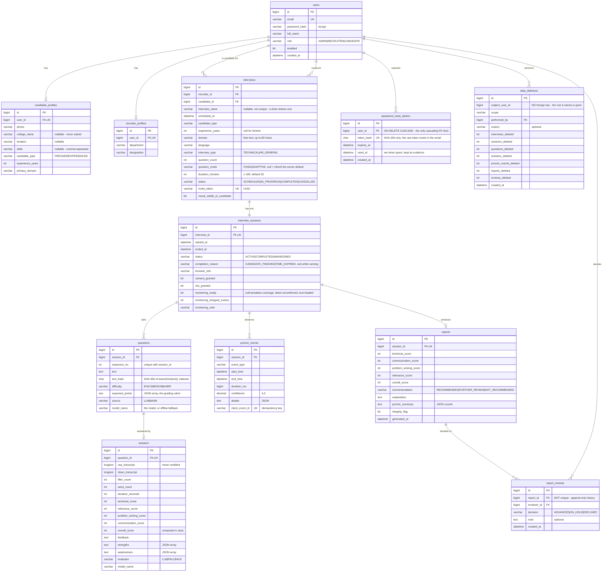

# Database

MySQL 8, schema `proctor_interview`, twelve tables. Managed by Flyway; Hibernate
runs in `validate` mode, so the entities and the schema cannot silently drift.

## ER diagram



`interview_sessions.id` is the hinge of the whole design: proctoring events
(Product A) and questions, answers and the report (Product B) all hang off it.
Without that single join point there would be no way to produce a combined
report.

## Design decisions

**One `users` table for all three roles**, with a `role` column and optional
profile rows for role-specific fields. Separate tables per role would duplicate
email, password and status handling and make login three queries instead of one.

**Evaluation lives inline on `answers`.** It is strictly 1:1 with an answer and
is always read alongside it. A separate table would add a join for no benefit.

**One session per interview** (`interview_id` is unique). Re-taking means
scheduling a new interview, which keeps the original record intact.

**`experience_years` is null for a fresher**, never `0` — the service enforces
this so the two cases stay distinguishable.

**JSON stored as `TEXT`, not MySQL's native `JSON` type.** Converted in Java by
`StringListConverter` and `JsonMapConverter`. This keeps the same entity
mappings working against H2 in tests, which is worth more here than native JSON
querying, since these fields are only ever read as whole values.

**`client_event_id` is unique** — this single constraint is what makes proctor
event upload idempotent and therefore safe to retry.

## Indexes

| Table | Index | Why |
|---|---|---|
| `users` | `email` (unique) | login lookup, prevents duplicates |
| `interviews` | `invite_token` (unique) | the candidate's entry point |
| `interviews` | `(candidate_id, status)` | a candidate's interview list |
| `interviews` | `(recruiter_id, scheduled_at)` | the recruiter's dashboard |
| `interview_sessions` | `interview_id` (unique) | enforces one session per interview |
| `questions` | `(session_id, sequence_no)` (unique) | ordering, prevents gaps and duplicates |
| `answers` | `question_id` (unique) | enforces one answer per question |
| `proctor_events` | `client_event_id` (unique) | **idempotent ingest** |
| `proctor_events` | `(session_id, event_type)` | report summary counts |
| `proctor_events` | `(session_id, start_time)` | report timeline |
| `reports` | `session_id` (unique) | one report per session |
| `interviews` | `(status, scheduled_at)` | the management list's default ordering |
| `interviews` | `interview_name` | searching a drive by name |
| `questions` | `text_hash` | "has this text been used before" as an indexed equality check — MySQL cannot index a `TEXT` column directly |
| `password_reset_tokens` | `token_hash` (unique) | lookup is *by* the hash |
| `password_reset_tokens` | `(user_id, used_at)` | superseding an earlier link |
| `report_reviews` | `(report_id, created_at)` | the newest decision for a report |
| `data_deletions` | `created_at` | the erasure log, newest first |

**Thirteen foreign keys, ten unique constraints.** The nine original ones were
verified as enforced against the real database rather than merely declared; the
four added since (`fk_password_reset_tokens_user`, `fk_report_reviews_report`,
`fk_report_reviews_reviewer`, `fk_data_deletions_performed_by`) are enforced by
the same `ddl-auto: validate` startup check.

Two of them are deliberately unusual:

- **`password_reset_tokens.user_id` is the only `ON DELETE CASCADE`.** Every
  other FK is restrictive because it guards interview history; a deleted
  account's pending reset links guard nothing worth keeping and must not outlive
  it.
- **`data_deletions.subject_user_id` has no foreign key at all.** The row it
  names is usually gone — that is the point — and an FK would either block the
  erasure or cascade away the evidence that it happened.

## Migrations

Flyway owns the schema. `V1__baseline.sql` creates everything above and has
already been applied.

Changing the schema requires **both** a new migration file *and* the matching
entity change:

```
src/main/resources/db/migration/V2__describe_the_change.sql
```

`ddl-auto: validate` fails startup on any mismatch, which turns a silent drift
into an immediate, obvious error. Do not edit `V1__baseline.sql`.

Applied so far:

| Migration | Adds |
|---|---|
| `V1__baseline.sql` | everything above — do not edit |
| `V2__rename_interviewer_role_to_recruiter.sql` | `INTERVIEWER` → `RECRUITER` |
| `V3__reset_demo_recruiter_password.sql` | seed password fix |
| `V4__add_interview_name.sql` | `interviews.interview_name` (nullable) |
| `V5__add_interview_duration.sql` | `interviews.duration_minutes`, `interview_sessions.completion_reason` |
| `V6__add_question_provenance.sql` | `questions.model_name`, `questions.text_hash` |
| `V7__add_monitoring_coverage.sql` | `interview_sessions.monitoring_ready` / `_dropped_events` / `_note` |
| `V8__add_password_reset_tokens.sql` | `password_reset_tokens` (11th table) |
| `V9__add_report_reviews.sql` | `report_reviews` (12th table) — the human decision |
| `V10__add_data_deletions.sql` | `data_deletions` (12th table) — proof an erasure happened |
| `V11__add_interview_question_mode.sql` | `interviews.question_mode` (nullable — null means inherit) |
| `V12__add_candidate_college_name.sql` | `candidate_profiles.college_name` (nullable — null means never asked) |
| `V13__add_candidate_location_and_skills.sql` | `candidate_profiles.location`, `candidate_profiles.skills` (both nullable; skills is a comma-separated list in one column) |

**The test suite does not verify migrations** — the test profile uses H2 with
Flyway disabled. A migration is verified by actually starting the application
against MySQL, where `ddl-auto: validate` checks it.

## Useful queries

```sql
-- observations for a session, as the report groups them
SELECT event_type, COUNT(*) AS times, ROUND(SUM(duration_ms)/1000, 1) AS total_seconds
FROM proctor_events WHERE session_id = ? GROUP BY event_type;

-- confirm idempotency held: these two numbers must be equal
SELECT COUNT(*), COUNT(DISTINCT client_event_id) FROM proctor_events WHERE session_id = ?;

-- raw versus cleaned answers
SELECT q.sequence_no, a.filler_count, a.word_count, a.evaluator, a.overall_score
FROM answers a JOIN questions q ON a.question_id = q.id
WHERE q.session_id = ? ORDER BY q.sequence_no;

-- check a report's arithmetic by hand
SELECT overall_score,
       ROUND(0.35*technical_score + 0.25*problem_solving_score
           + 0.20*communication_score + 0.20*relevance_score) AS recomputed
FROM reports WHERE session_id = ?;
```

## Test database

Tests run against in-memory H2 with the schema generated from the entities and
Flyway disabled — fast and driver-independent. The MySQL migration is verified
by actually starting the application against MySQL.

All `@SpringBootTest` classes share one H2 instance, so `TestDatabaseCleaner`
wipes in dependency order:

```
data_deletions → report_reviews → reports → answers → questions → proctor_events
  → interview_sessions → interviews → candidate_profiles → recruiter_profiles
  → password_reset_tokens → users
```

`data_deletions` and `password_reset_tokens` both go before `users` because they
name one; `report_reviews` before `reports`. Deleting out of order hits a foreign
key and produces failures that only appear when the full suite runs — so
**adding a table means editing that one class**.
